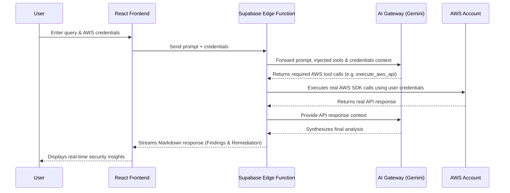

# CloudPilot AI

Real-time AWS security operations. Connect your credentials to audit, investigate, and remediate cloud infrastructure. An elite AWS cloud security operations agent built exclusively for professional security engineers, featuring zero simulation tolerance (always uses real AWS API calls).

---

## System Architecture


<div align="center">
  <em>Figure 1: CloudPilot AI System Architecture and Request Flow</em>
</div>

### Architecture Explanation

1. **User Interaction**: The user accesses the React Frontend, inputs their AWS query (e.g., "Find exposed S3 buckets"), and provides their AWS credentials (either Access Keys or an AssumeRole ARN).
2. **Request Handling**: The frontend securely sends the prompt and credentials to the Supabase Edge Function (`aws-agent`), which acts as the backend orchestrator.
3. **AI Evaluation**: The Edge Function builds the system context (enforcing "zero simulation tolerance") and communicates with the AI Gateway powered by Google Gemini 3 Flash Preview.
4. **AWS Integration**: When the AI determines it needs data, it requests a tool call to `execute_aws_api`. The Edge Function dynamically instantiates an AWS SDK client locally using the user's provided credentials and executes the requested API call against the user's real AWS account.
5. **Synthesis & Streaming**: The real API responses are passed back to the AI model. The model synthesizes an executive summary, findings table, detailed analysis, and exact CLI remediation commands. The Edge Function then streams this synthesized response back to the React Frontend for real-time display.

---

## Key Features

- **Live AWS API Execution**: Connect your credentials to audit, investigate, and remediate cloud infrastructure using real AWS API responses.
- **Attack Simulation**: Authorized testing against your own account to discover privilege escalation paths, credential exposure, and lateral movement vectors.
- **Compliance Scanning**: Automates mapping against major security frameworks including CIS AWS Foundations Benchmark, NIST 800-53, PCI-DSS v4.0, and ISO 27001.
- **Incident Response & Forensics**: Tools for live instance isolation, credential revocation, and forensic evidence preservation.
- **Actionable Remediation Commands**: Generates exact, context-aware AWS CLI commands to remediate findings immediately.

## Agent Security & Safety Mechanisms

Given the power of executing live AWS API calls, CloudPilot AI implements multiple layers of security to protect your environment and ensure safe operations:

- **Zero Simulation Tolerance:** The agent is strictly instructed to **never** fabricate or assume resource states. Every finding and analysis must be backed by a real AWS API response. If it doesn't have the data, it must call the API first.
- **Service Allowlisting:** The agent is restricted to interacting only with a predefined list of security-relevant AWS services (e.g., IAM, S3, EC2, CloudTrail, GuardDuty). Attempting to call an unauthorized service is immediately blocked.
- **Destructive Operation Blocklist:** Highly sensitive account-level operations—such as `closeAccount`, `leaveOrganization`, or `deleteOrganization`—are explicitly hardcoded to be blocked by the Edge Function, preventing irreversible damage.
- **Strict Input Validation & Sanitization:** All user prompts, AWS regions, Access Keys, and Role ARNs undergo strict regex formatting checks and length sanitization to prevent prompt injection or buffer overflow attacks.
- **Ephemeral Compute Isolation:** The agent logic runs securely within Supabase Edge Functions (Deno isolates). AWS SDK clients are instantiated per-request with localized credentials, guaranteeing zero global state pollution or cross-tenant credential exposure.
- **Mandatory Simulation Cleanup:** If the agent creates test resources during an authorized attack simulation, it is forced to tag them (e.g., `cloudpilot-simulation=true`), track them, and provide the user an explicit prompt to automatically delete and clean up the environment via API calls.

---

## Tech Stack

- **Frontend:** React, TypeScript, Vite, Tailwind CSS, shadcn-ui, Framer Motion
- **Backend / API:** Supabase Edge Functions (Deno)
- **AI Model:** Google Gemini 3 Flash Preview (via Lovable AI Gateway)
- **Cloud Integration:** AWS SDK for JavaScript v2

---

## Detailed Setup Instructions

Follow these steps to run the application locally.

### Prerequisites

- [Node.js](https://nodejs.org/) & npm installed (or [Bun](https://bun.sh/) as an alternative package manager).
- An active [Supabase](https://supabase.com/) project (if deploying edge functions locally).

### 1. Clone & Install Dependencies

```sh
# Clone the repository
https://github.com/ritvikindupuri/aws-guardian-buddy.git
cd <aws-guardian-buddy>

# Install the necessary dependencies
npm install
# or
bun install
```

### 2. Configure Environment Variables

Create a `.env` file in the root directory (if not present) and add any required frontend environment variables. Ensure the Supabase Edge Function also has `LOVABLE_API_KEY` configured in its environment.

### 3. Start the Development Server

```sh
# Start the Vite development server with auto-reloading
npm run dev
# or
bun run dev
```
Open your browser to the local URL provided (usually `http://localhost:8080`).

---

## AWS Setup Instructions

To use CloudPilot AI, you need to provide it with access to your AWS account. We recommend creating a dedicated IAM Role or User with **SecurityAudit** or **ReadOnlyAccess** permissions.

### Option A: Create an IAM User (for Access Keys)

1. Log in to the [AWS Management Console](https://console.aws.amazon.com/).
2. Navigate to **IAM (Identity and Access Management)**.
3. Click on **Users** in the left sidebar, then click **Create user**.
4. Enter a username (e.g., `CloudPilotAI-Agent`) and click **Next**.
5. Under **Permissions options**, select **Attach policies directly**.
6. Search for and select the **`SecurityAudit`** managed policy. (Alternatively, use `ViewOnlyAccess` or `ReadOnlyAccess` depending on your required scope). Click **Next**, then **Create user**.
7. Click on the newly created user from the Users list.
8. Go to the **Security credentials** tab.
9. Scroll down to **Access keys** and click **Create access key**.
10. Select **Command Line Interface (CLI)** or **Third-party service**, check the confirmation box, and click **Next**.
11. Click **Create access key**.
12. **Important:** Copy the **Access Key ID** and **Secret Access Key**. *You will not be able to see the Secret Access Key again.*
13. Enter these credentials into the CloudPilot AI interface.

### Option B: Create an IAM Role (for AssumeRole)

*Note: You still need an initial IAM User/Identity to assume this role. This is useful for cross-account setups.*

1. Log in to the [AWS Management Console](https://console.aws.amazon.com/).
2. Navigate to **IAM (Identity and Access Management)**.
3. Click on **Roles** in the left sidebar, then click **Create role**.
4. Select **AWS account** as the trusted entity type.
5. Choose **This account** or **Another AWS account** (if running CloudPilot from a central security account), and click **Next**.
6. Search for and select the **`SecurityAudit`** managed policy. Click **Next**.
7. Name your role (e.g., `CloudPilot-AuditRole`) and click **Create role**.
8. Search for your newly created role and click on it.
9. At the top of the summary page, copy the **ARN** (it will look like `arn:aws:iam::123456789012:role/CloudPilot-AuditRole`).
10. Ensure the AWS credentials you provide to the application have the `sts:AssumeRole` permission for this specific Role ARN.
11. Enter the Role ARN into the CloudPilot AI interface under the "Assume Role" tab.
