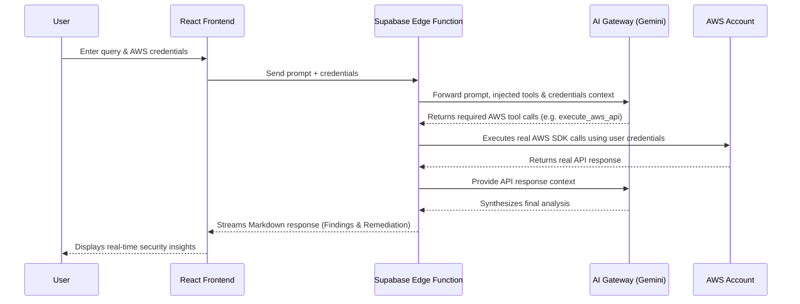

# Technical Documentation: CloudPilot AI

**By:** Ritvik Indupuri
**Date:** March 16, 2026

---

## Executive Summary

CloudPilot AI is an elite AWS cloud security operations agent designed explicitly for professional security engineers. It operates as a real-time conversational interface where users can interactively audit, investigate, and remediate AWS cloud infrastructure using natural language queries.

Unlike traditional cloud security posture management (CSPM) tools or purely generative AI assistants, CloudPilot AI employs a strict "Zero Simulation Tolerance" policy. Every insight, security finding, and configuration analysis provided by the agent is backed by real, authenticated AWS API calls executed securely on behalf of the user. This guarantees that the intelligence is accurate, contextual, and actionable.

The application is built on a modern, highly responsive stack. The frontend leverages React, Vite, Tailwind CSS, and shadcn-ui for a seamless user experience, incorporating features like real-time chat, AWS credential management, chat history persistence, and actionable finding panels. The backend is orchestrated by Supabase Edge Functions running on Deno, which seamlessly broker communications between the React client, Google's Gemini 3 Flash Preview (via Lovable AI Gateway), and the user's AWS account via the AWS SDK.

By tightly coupling LLM reasoning capabilities with strict, restricted, and auditable AWS API execution, CloudPilot AI empowers security teams to conduct complex authorized attack simulations, map compliance against major frameworks (CIS, NIST, PCI-DSS), perform incident response, and generate context-aware CLI remediation commands—all from a single, unified interface.

---

## System Architecture

The architecture of CloudPilot AI is designed to ensure strict separation of concerns, secure handling of credentials, and responsive streaming of AI-generated insights.

  <em>Figure 1: CloudPilot AI System Architecture and Request Flow</em>

### Flow-by-Flow Explanation

1. **User Interaction & Credential Input:**
   The User accesses the React Frontend and inputs an AWS security query (e.g., "Find exposed S3 buckets"). They also provide AWS credentials, either via direct Access Keys or by specifying an AssumeRole ARN. The frontend safely stores this context in memory.

2. **Request Orchestration:**
   The frontend packages the user's prompt, the conversation history, and the AWS credentials into a secure payload and sends it to the Supabase Edge Function (`aws-agent`).

3. **System Context & AI Invocation:**
   The Edge Function acts as the central orchestrator. It receives the payload, validates the credentials format, and constructs a strict system prompt enforcing "Zero Simulation Tolerance." It then forwards this context to the Lovable AI Gateway, which proxies the request to the Google Gemini 3 Flash Preview model. The prompt strictly instructs the AI to use provided tools (`execute_aws_api`) before formulating any answer.

4. **Tool Calling & Local Execution:**
   When the AI determines it needs AWS data to answer the query, it returns a tool call requesting a specific AWS service and operation (e.g., `S3.listBuckets`). The Edge Function intercepts this tool call.

5. **AWS API Integration:**
   Crucially, the Edge Function dynamically instantiates an AWS SDK client locally within its Deno isolate, using the *user's provided credentials*. It executes the requested API call directly against the user's real AWS Account.

6. **Feedback Loop:**
   The real API response from AWS is captured by the Edge Function and appended to the conversation context as a tool response. This updated context is sent back to the AI Gateway. This agentic loop can iterate multiple times if the AI requires more data from different APIs.

7. **Synthesis & Streaming Response:**
   Once the AI has gathered sufficient real data, it synthesizes a final analysis (including an executive summary, findings table, detailed evidence, and CLI remediation commands). The Edge Function streams this final markdown response back to the React Frontend using Server-Sent Events (SSE).

8. **Presentation:**
   The React Frontend receives the streamed response and dynamically renders it using `react-markdown`, providing the User with immediate, actionable security insights.

---

## Detailed Codebase & Feature Breakdown

This section details every component, file, and feature integrated into the CloudPilot AI codebase, mapping them to their purpose within the overall architecture.

### 1. Frontend Architecture (React + Vite)

The frontend is a Single Page Application (SPA) built with React 18 and Vite. It utilizes a robust ecosystem of tools:
- **Routing:** `react-router-dom` handles client-side routing between the main chat interface (`/`), authentication (`/auth`), individual reports (`/report/:id`), and error pages (`*`).
- **State & Data Fetching:** `@tanstack/react-query` manages asynchronous data fetching, particularly for chat history and Supabase backend interactions. Custom hooks (`useAuth`, `useChat`, `useChatHistory`) abstract complex state logic.
- **Styling & UI Components:** The UI is constructed using Tailwind CSS and `shadcn/ui` components (built on Radix UI primitives), ensuring a highly accessible, customizable, and modern design system. The components reside in `src/components/ui/`.
- **Markdown Rendering:** `react-markdown` combined with `remark-gfm` is used to accurately render the complex Markdown responses streamed from the AI, including code blocks and tables.

#### Core Pages
- **`src/App.tsx`:** The root component that sets up providers (`QueryClientProvider`, `TooltipProvider`), routing, and protected routes requiring authentication.
- **`src/pages/Index.tsx`:** The main entry point for authenticated users, rendering the `ChatInterface`.
- **`src/pages/Auth.tsx`:** Handles user authentication (login/signup) via Supabase Auth.
- **`src/pages/Report.tsx`:** A dedicated view for viewing specific historical chat reports.
- **`src/pages/NotFound.tsx`:** Fallback for unmatched routes.

#### Key UI Components
- **`src/components/ChatInterface.tsx`:** The core workspace. It orchestrates the chat layout, input handling, sidebar toggling, and integrates various sub-panels (credentials, history, findings).
- **`src/components/AwsCredentialsPanel.tsx`:** A secure form allowing users to input AWS Access Keys or AssumeRole ARNs. It manages the local credential state required for the backend agent.
- **`src/components/ChatMessage.tsx`:** Renders individual messages (user or assistant). It handles Markdown parsing and applies appropriate styling for system prompts vs. standard responses.
- **`src/components/ChatHistoryPanel.tsx`:** Interacts with `useChatHistory` to display past conversations, allowing users to resume previous auditing sessions.
- **`src/components/FindingsPanel.tsx`:** Displays a summary of identified security issues extracted from the conversation context.
- **`src/components/QuickActions.tsx`:** Provides predefined prompts (e.g., "Scan exposed S3 buckets") to accelerate common security workflows.
- **`src/components/StatusBar.tsx`:** Displays the current connection status, active AWS region, and message count.

### 2. Backend Orchestration (Supabase Edge Functions)

The backend logic resides entirely within a Supabase Edge Function (`supabase/functions/aws-agent/index.ts`), executed via Deno. This serverless approach guarantees scalable, ephemeral compute environments.

#### The `aws-agent` Service
- **System Prompt Engineering:** The function defines an extensive `SYSTEM_PROMPT` that strictly dictates the AI's behavior. It enforces:
  - **Zero Simulation Tolerance:** Mandating API execution before reporting.
  - **Execution Protocol:** The step-by-step logic for identifying APIs, calling tools, and synthesizing findings.
  - **Attack Simulation Lifecycle:** A mandatory protocol (Tagging, Tracking, Completion Block, Cleanup) to safely manage resources created during authorized attack simulations.
- **Tool Definition:** It defines a single, powerful tool for the LLM: `execute_aws_api`. This tool requires a `service` (e.g., 'S3', 'IAM'), an `operation` (e.g., 'listBuckets'), and `params`.
- **Secure Request Handling & Validation:**
  - Validates incoming message arrays and ensures content limits (`MAX_MESSAGE_LENGTH`, `MAX_MESSAGES`).
  - Implements strict RegEx validation for AWS Regions (`AWS_REGION_REGEX`), Access Keys (`ACCESS_KEY_REGEX`), and Role ARNs (`ROLE_ARN_REGEX`).
- **Dynamic AWS Credential Resolution:**
  - If the user provides Access Keys, it uses them directly.
  - If the user provides a Role ARN, it dynamically calls `sts.assumeRole` to fetch temporary credentials scoped to that session, ensuring least privilege access.
- **The Agentic Loop:**
  - The function iterates up to `MAX_ITERATIONS` (15).
  - It sends context to the Gemini model.
  - If the model returns a tool call (`execute_aws_api`), the function intercepts it.
  - **Security Gateways:** Before executing the SDK call, it verifies the requested service against an `ALLOWED_AWS_SERVICES` list and explicitly blocks destructive actions via a `BLOCKED_OPERATIONS` list (e.g., `closeAccount`, `leaveOrganization`).
  - It dynamically invokes the `aws-sdk` with the localized credentials.
  - It catches errors, sanitizes extremely large responses to prevent context overflow, and feeds the real data back to the LLM.
- **SSE Streaming:** Once the AI finishes tool calling, the Edge Function streams the synthesized markdown response back to the client using Server-Sent Events, providing a real-time typing effect.

### 3. Security & Safety Mechanisms

Given the inherent risks of executing live AWS API calls, CloudPilot AI implements multi-layered security controls directly within the codebase:

1. **Ephemeral Compute Isolation:** Running on Deno isolates via Supabase Edge Functions ensures that AWS SDK clients are instantiated strictly on a per-request basis. There is zero global state pollution, completely eliminating the risk of cross-tenant credential exposure.
2. **Service Allowlisting:** The `ALLOWED_AWS_SERVICES` Set in `aws-agent/index.ts` restricts the AI to interacting only with predefined security-relevant services, preventing lateral movement into unexpected or unmanaged service tiers.
3. **Destructive Operation Blocklist:** The `BLOCKED_OPERATIONS` Set hardcodes protections against catastrophic account actions (e.g., deleting organizations or closing accounts), even if the provided credentials possess such permissions.
4. **Strict Input Sanitization:** The `sanitizeString` function is heavily utilized across all inputs (region, credentials, message content) to strip control characters and prevent prompt injection or buffer overflow attacks.
5. **Mandatory Simulation Cleanup:** The system prompt explicitly dictates that if the agent creates resources (e.g., a test IAM user during an escalation simulation), it must tag them, track them, and present an explicit "Cleanup Required" prompt to the user to ensure no artifacts are left behind.

---

## Conclusion

CloudPilot AI represents a significant advancement in applied generative AI for cloud security operations. By bridging the reasoning capabilities of state-of-the-art large language models with the strict, deterministic execution of real AWS APIs, it eliminates the "hallucination" problem common in standard chat assistants.

The architecture is meticulously designed for security, employing robust input validation, secure credential handling, ephemeral isolated execution, and strict operational allowlists. The comprehensive React frontend provides a professional, highly responsive interface tailored for security engineers, enabling complex auditing, incident response, and authorized attack simulations to be conducted safely and efficiently directly against live AWS environments.

Through its uncompromising "Zero Simulation Tolerance" and robust technical foundation, CloudPilot AI delivers highly accurate, contextual, and actionable intelligence, empowering security teams to identify and remediate vulnerabilities faster and more effectively.
