# Technical Documentation: CloudPilot AI

**By:** Ritvik Indupuri  
**Date:** March 16, 2026

---

## Executive Summary

CloudPilot AI is an elite AWS cloud security operations agent designed explicitly for professional security engineers. It operates as a real-time conversational interface where users can interactively audit, investigate, and remediate AWS cloud infrastructure using natural language queries.

Unlike traditional cloud security posture management (CSPM) tools or purely generative AI assistants, CloudPilot AI employs a strict **"Zero Simulation Tolerance"** policy. Every insight, security finding, and configuration analysis provided by the agent is backed by real, authenticated AWS API calls executed securely on behalf of the user. This guarantees that the intelligence is accurate, contextual, and actionable.

The application is built on a modern, highly responsive stack. The frontend leverages React, Vite, Tailwind CSS, and shadcn-ui for a seamless user experience, incorporating features like real-time chat, AWS credential management (including **Pre-Flight IAM Boundary Checks** that render a capability checklist), chat history persistence, and actionable finding panels. The backend is orchestrated by Supabase Edge Functions running on Deno, which seamlessly broker communications between the React client, Google's Gemini 2.5 Flash (via Lovable AI Gateway), and the user's AWS account via the AWS SDK. A lightweight **Intent Router** powered by Gemini 2.5 Flash Lite classifies each query before the main agent loop, selecting only the relevant tool subset to reduce token usage and improve accuracy.

For security operations with absolute privacy requirements, the backend supports configurations to use **PrivateLink / VPC Endpoints**, ensuring that AWS API calls never route over the public internet. By configuring Private DNS in your VPC endpoints, the AWS SDK will automatically route traffic locally. Additionally, all API tool executions perform **WORM Audit Logging**, directly streaming request payloads into an immutable S3 bucket configured for Write-Once-Read-Many storage.

By tightly coupling LLM reasoning capabilities with strict, restricted, and auditable AWS API execution, CloudPilot AI empowers security teams to conduct complex authorized attack simulations, map compliance against major frameworks (CIS, NIST, PCI-DSS), perform incident response, and generate context-aware CLI remediation commands—all from a single, unified interface.

---

## Table of Contents

1. [System Architecture](#1-system-architecture)
2. [Typical User Query Flow](#2-typical-user-query-flow)
3. [AWS Credential Configuration & IAM Permissions Impact](#3-aws-credential-configuration--iam-permissions-impact)
4. [STS Credential Exchange — Zero Raw Key Transmission](#4-sts-credential-exchange--zero-raw-key-transmission)
5. [Frontend Architecture](#5-frontend-architecture)
6. [Backend Orchestration — The `aws-agent` Edge Function](#6-backend-orchestration--the-aws-agent-edge-function)
7. [Edge Function Decomposition — Router, Scanner, Ops, and Executor](#7-edge-function-decomposition--router-scanner-ops-and-executor)
8. [AWS Services & Capabilities](#8-aws-services--capabilities)
9. [Quick Actions — Pre-Built Security Workflows](#9-quick-actions--pre-built-security-workflows)
10. [Security & Safety Mechanisms](#10-security--safety-mechanisms)
11. [Privilege Escalation Validator](#11-privilege-escalation-validator)
12. [Agent Audit Log — Triple-Sink Architecture](#12-agent-audit-log--triple-sink-architecture)
13. [Authentication & User Management](#13-authentication--user-management)
14. [Chat History & Persistence](#14-chat-history--persistence)
15. [Output Formatting & Markdown Rendering](#15-output-formatting--markdown-rendering)
16. [API Limits & Rate Limiting](#16-api-limits--rate-limiting)
17. [Email Notifications via AWS SNS](#17-email-notifications-via-aws-sns)
18. [Report Management — S3 Archival, PDF Export & Reports History](#18-report-management--s3-archival-pdf-export--reports-history)
19. [UX Enhancements — Thinking Indicator & Permission Error Clarity](#19-ux-enhancements--thinking-indicator--permission-error-clarity)
20. [Compliance Frameworks](#20-compliance-frameworks)
21. [VPC Endpoint Configuration Guide — Fully Private AWS API Routing](#21-vpc-endpoint-configuration-guide--fully-private-aws-api-routing)
22. [CloudWatch Automation](#22-cloudwatch-automation)
23. [Unified Audit Engine](#23-unified-audit-engine)
24. [IAM Automation — Preview, Confirm, Execute](#24-iam-automation--preview-confirm-execute)
25. [Security Group Automation — Risk-Gated Mutations](#25-security-group-automation--risk-gated-mutations)
26. [Cost Automation — Rules, Anomalies, and Remediation](#26-cost-automation--rules-anomalies-and-remediation)
27. [Drift Detection — Baselines, Diffs, and Morning Digests](#27-drift-detection--baselines-diffs-and-morning-digests)
28. [Guardian Automation — Scheduler and Event Processor](#28-guardian-automation--scheduler-and-event-processor)
29. [AWS Organizations Automation](#29-aws-organizations-automation)
30. [Runbook Execution Engine](#30-runbook-execution-engine)
31. [Operations Control Plane](#31-operations-control-plane)
32. [AES-256-GCM Credential Vault](#32-aes-256-gcm-credential-vault)
33. [RBAC & Multi-Tenant Organization System](#33-rbac--multi-tenant-organization-system)
34. [Multi-Factor Authentication (MFA) Enrollment](#34-multi-factor-authentication-mfa-enrollment)
35. [Edge Function Rate Limiting](#35-edge-function-rate-limiting)
36. [Webhook Notification Integrations — Slack, PagerDuty & Generic](#36-webhook-notification-integrations--slack-pagerduty--generic)
37. [Guided Onboarding Wizard](#37-guided-onboarding-wizard)
38. [End-to-End Test Suite](#38-end-to-end-test-suite)
39. [Team Management UI](#39-team-management-ui)
40. [Production Readiness Roadmap](#40-production-readiness-roadmap)
41. [Conclusion](#41-conclusion)

---

## 1. System Architecture

The architecture of CloudPilot AI is designed to ensure strict separation of concerns, secure handling of credentials, and responsive streaming of AI-generated insights. The system is organized into four distinct layers: Client, Backend, AI, and AWS. Each layer has clearly defined responsibilities and communicates with its neighbors through authenticated, encrypted channels.

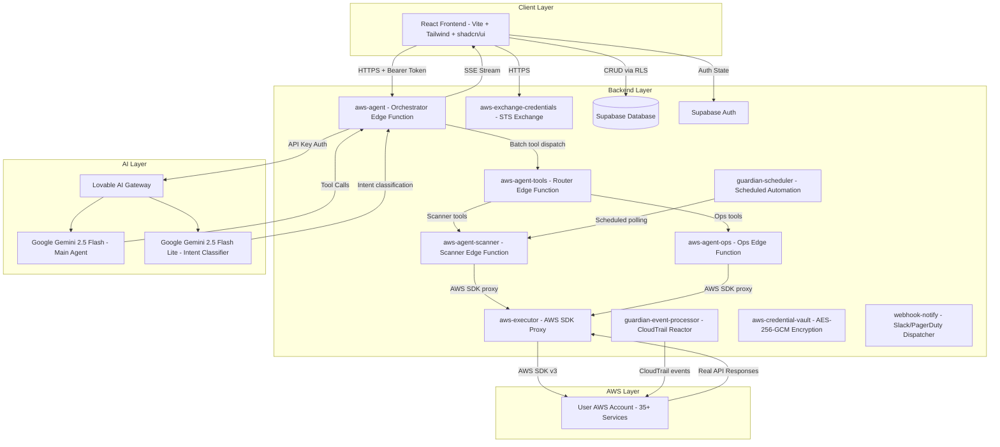

<div align="center">
  <em>Figure 1.1: CloudPilot AI High-Level System Architecture — All Eight Edge Functions and Four Layers</em>
</div>

**Figure 1.1 Explanation:**

This diagram illustrates the complete four-layer architecture of CloudPilot AI and the data flow between all components:

- **Client Layer:** The React frontend communicates with three backend services. It sends user queries and AWS session credentials to the `aws-agent` edge function over HTTPS with a Bearer token. It reads and writes chat history (conversations and messages) directly to the Supabase Database, protected by Row-Level Security (RLS) policies that scope all queries to the authenticated user. It manages authentication state through Supabase Auth. It also calls `aws-exchange-credentials` directly for STS credential exchange before any agent interaction.

- **Backend Layer:** Ten edge functions collaborate to deliver the full feature set:
  - **`aws-agent`** (1,337 lines) — The central orchestrator. Receives the user query, classifies intent using an LLM-based router (Gemini 2.5 Flash Lite), selects only the relevant tool subset for the classified intent, manages the agentic loop with the main AI model (Gemini 2.5 Flash), dispatches tool calls to `aws-agent-tools`, and streams the final response back as SSE.
  - **`aws-agent-tools`** (75 lines) — A thin router that classifies incoming tool calls and dispatches them in parallel to either `aws-agent-scanner` or `aws-agent-ops`.
  - **`aws-agent-scanner`** (2,987 lines) — Handles `run_unified_audit`, `run_cost_anomaly_scan`, `manage_cost_rule`, `manage_drift_baseline`, `run_drift_detection`, and `execute_aws_api`. Contains the unified audit engine, cost anomaly detection, drift detection, and raw AWS API execution logic.
  - **`aws-agent-ops`** (4,572 lines) — Handles `manage_runbook_execution`, `manage_event_response_policy`, `replay_cloudtrail_events`, `run_org_query`, `manage_org_operation`, `manage_security_group_rule`, `manage_iam_access`, `run_attack_simulation`, and `run_evasion_test`. Contains the operational automation, org-wide queries, security group mutations, IAM automation, attack simulation, and evasion testing logic.
  - **`aws-executor`** (104 lines) — A dedicated AWS SDK v3 proxy that dynamically loads any of the 35+ `@aws-sdk/client-*` packages on demand. Both `aws-agent-scanner` and `aws-agent-ops` delegate all AWS API calls to this function via `fetch`, avoiding bundle timeout issues that would occur if each function imported all SDK clients directly.
  - **`aws-exchange-credentials`** (255 lines) — Handles the STS credential exchange protocol. Validates raw user credentials, calls `STS:GetCallerIdentity` and `STS:GetSessionToken` (or `STS:AssumeRole`), performs pre-flight IAM boundary checks via `SimulatePrincipalPolicy`, and returns only temporary session credentials.
  - **`guardian-scheduler`** (850+ lines) — The scheduled automation engine with AES-256-GCM credential decryption and token-bucket rate limiting. Authenticated via `GUARDIAN_AUTOMATION_WEBHOOK_SECRET`, it runs cost anomaly scans, drift detection, and alert dispatch on a schedule triggered by `pg_cron` (PostgreSQL-native cron). Contains full cost data fetching, anomaly detection, idle EC2 analysis, and drift scanning logic. The `pg_cron` job executes hourly using `pg_net` to POST to the function endpoint.
  - **`guardian-event-processor`** (499 lines) — The real-time CloudTrail event reactor. Enriches incoming CloudTrail events, scores risk, matches against built-in and user-defined policies, and executes auto-fix actions (e.g., restoring S3 public access blocks, restarting CloudTrail logging, revoking world-open security group rules). Also triggers runbook executions and records drift events.
  - **`aws-credential-vault`** (170 lines) — The AES-256-GCM credential encryption/decryption service. Uses PBKDF2 with 100,000 iterations to derive per-user encryption keys from the service role key. Handles `encrypt_and_store` (for client credential submission) and `decrypt` (for guardian-scheduler autonomous scans). See Section 32 for full details.
  - **`webhook-notify`** (250 lines) — The external notification dispatcher. Sends Guardian alerts, auto-fix notifications, drift events, and cost anomalies to Slack (Block Kit), PagerDuty (Events API v2), or generic webhook endpoints. Manages webhook registration, listing, and deletion. See Section 36 for full details.

- **AI Layer:** The Lovable AI Gateway proxies requests to two Google Gemini models. The **Intent Classifier** uses Gemini 2.5 Flash Lite (fastest, cheapest) for a single classification call that determines which tool subset to activate. The **Main Agent** uses Gemini 2.5 Flash (balanced speed and capability) for the multi-iteration agentic loop with tool calling. This two-model architecture reduces token usage by 40-70% on focused queries by excluding irrelevant tools from the context.

- **AWS Layer:** The user's real AWS account, accessed via AWS SDK v3 through the `aws-executor` proxy using temporary session credentials. The agent can interact with 35+ security-relevant services.

- **Data Flow:** Queries flow from the client to `aws-agent` to the AI Gateway to Gemini. When Gemini returns tool calls, `aws-agent` batches them to `aws-agent-tools`, which routes them to `aws-agent-scanner` or `aws-agent-ops`. These functions call `aws-executor` for any AWS SDK operations. Real API responses flow back through the chain to Gemini for analysis. The final Markdown response is streamed to the client via SSE.

### Component Responsibilities

| Component | Technology | Responsibility |
|-----------|-----------|----------------|
| React Frontend | React 18, Vite, Tailwind CSS, shadcn/ui | User interface, credential management, chat rendering, SSE consumption |
| `aws-agent` | Deno Edge Function (1,337 lines) | Intent classification, AI orchestration, agentic tool-call loop, SSE streaming |
| `aws-agent-tools` | Deno Edge Function (75 lines) | Tool call routing to scanner and ops sub-functions |
| `aws-agent-scanner` | Deno Edge Function (2,987 lines) | Unified audit, cost anomaly, drift detection, raw AWS API execution |
| `aws-agent-ops` | Deno Edge Function (4,572 lines) | IAM/SG automation, runbooks, org queries, attack simulation, evasion testing |
| `aws-executor` | Deno Edge Function (104 lines) | AWS SDK v3 dynamic loader and proxy |
| `aws-exchange-credentials` | Deno Edge Function (255 lines) | STS credential exchange, IAM boundary checks |
| `guardian-scheduler` | Deno Edge Function (598 lines) | Scheduled cost/drift polling and alerting |
| `guardian-event-processor` | Deno Edge Function (499 lines) | Real-time CloudTrail event reaction and auto-fix |
| Supabase Auth | Supabase Auth (email/password) | User registration, login, session management |
| Supabase Database | PostgreSQL + RLS | Chat history, audit logs, cache, idempotency keys |
| Lovable AI Gateway | Gateway proxy | Routes to Gemini 2.5 Flash Lite (intent classifier) and Gemini 2.5 Flash (main agent) |
| AWS Account | AWS SDK v3 (35+ services) | Real infrastructure data, configuration states, resource management |

---

## 2. Typical User Query Flow

Building on the system architecture described in Section 1, this section traces the complete lifecycle of a typical user query—from input to rendered response—illustrating every service interaction, every validation step, and every security check along the way. Understanding this flow is essential for grasping how the Zero Simulation Tolerance policy is enforced at every stage.

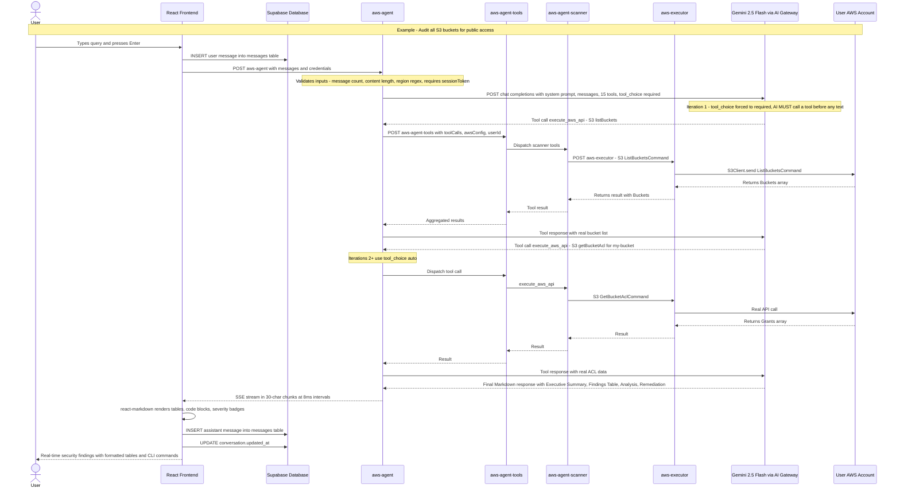

<div align="center">
  <em>Figure 2.1: Complete Lifecycle of a User Query — From Input Through All Eight Services to Rendered Response</em>
</div>

**Figure 2.1 Explanation:**

This sequence diagram traces the exact lifecycle of a typical user query ("Audit all S3 buckets for public access") through every system component, reflecting the actual decomposed architecture:

1. **User Input (User -> UI):** The user types a natural language query into the chat input and presses Enter (or clicks Send). The frontend validates that AWS credentials are configured before allowing submission.

2. **Immediate Persistence (UI -> DB):** The frontend immediately inserts the user's message into the `messages` table via Supabase. If no active conversation exists, a new `conversations` record is created first with the query text as the title (truncated to 65 characters). This ensures no user input is lost even if the subsequent API call fails.

3. **Edge Function Request (UI -> EF):** The frontend sends an HTTPS POST to `aws-agent`. The payload includes the full conversation history (`messages[]`) and the user's AWS session credentials (which were previously obtained via `aws-exchange-credentials`). The request includes the Supabase anon key as a Bearer token. Critically, `aws-agent` requires a `sessionToken` in the credentials and rejects any request missing one.

4. **Input Validation (EF):** Before any processing, `aws-agent` performs strict validation: the message array must be non-empty and contain at most 100 messages; each message content must not exceed 50,000 characters; the AWS region must match `/^[a-z]{2}(-[a-z]+-\d+)?$/`; all string inputs are sanitized to strip control characters via `sanitizeString()`.

5. **First AI Invocation — Forced Tool Call (EF -> AI):** The edge function constructs the full context: a system prompt enforcing Zero Simulation Tolerance (including all 15 tool usage protocols), the sanitized conversation history, the credential context string (masked key + region), and 15 tool definitions. On iteration 0, `tool_choice` is set to `"required"`, forcing the AI to make at least one tool call before generating text.

6. **Tool Call Routing (EF -> Router -> Scanner/Ops -> Executor -> AWS):** When Gemini returns tool calls, `aws-agent` batches them all into a single POST to `aws-agent-tools`. The router classifies each call: scanner tools (`execute_aws_api`, `run_unified_audit`, `run_cost_anomaly_scan`, `manage_cost_rule`, `manage_drift_baseline`, `run_drift_detection`) go to `aws-agent-scanner`; ops tools (`manage_runbook_execution`, `manage_event_response_policy`, `replay_cloudtrail_events`, `run_org_query`, `manage_org_operation`, `manage_security_group_rule`, `manage_iam_access`, `run_attack_simulation`, `run_evasion_test`) go to `aws-agent-ops`. Both scanner and ops functions delegate actual AWS SDK calls to `aws-executor`, which dynamically loads the appropriate `@aws-sdk/client-*` package and executes the command.

7. **Agentic Loop (up to 15 iterations):** This tool-call cycle can repeat up to 15 times. From iteration 2 onward, `tool_choice` switches to `"auto"`, allowing the AI to decide when it has gathered sufficient data.

8. **Final Synthesis (AI -> EF):** Once the AI determines it has enough real data, it synthesizes a structured Markdown response following the mandatory industry-grade report format.

9. **SSE Streaming (EF -> UI):** The final Markdown response is streamed back as Server-Sent Events. The text is split into 30-character chunks sent at 8ms intervals. Each chunk is wrapped in `data: {"choices":[{"delta":{"content":"..."}}]}\n\n`. The stream terminates with `data: [DONE]\n\n`.

10. **Frontend Rendering (UI):** The React frontend consumes the SSE stream via a `ReadableStream` reader in the `useChat` hook. As chunks arrive, they are accumulated and rendered in real-time using `react-markdown` with `remark-gfm`.

11. **Final Persistence (UI -> DB):** After the stream completes, the frontend persists the full assistant message to the `messages` table and updates the conversation's `updated_at` timestamp.

---

## 3. AWS Credential Configuration & IAM Permissions Impact

With the query lifecycle established in Section 2, it becomes clear that credentials are the foundation of every operation. This section explains how CloudPilot AI obtains, validates, and uses AWS credentials, and why the agent's capabilities are entirely bounded by the IAM permissions attached to those credentials.

### Credential Methods

CloudPilot AI supports two credential methods, configured via the `AwsCredentialsPanel` component:

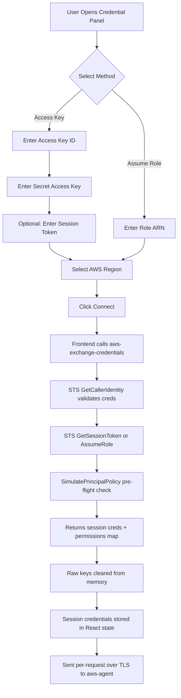

<div align="center">
  <em>Figure 3.1: AWS Credential Configuration Flow — From User Input to STS Exchange and IAM Boundary Checks</em>
</div>

**Figure 3.1 Explanation:**

This diagram shows the two credential paths and the STS exchange protocol that ensures raw keys never reach the agent:

- **Access Key Method (left path):** The user provides an IAM Access Key ID and Secret Access Key, with an optional Session Token. On "Connect", the frontend calls the `aws-exchange-credentials` edge function, which: validates the credential format using regex (`ACCESS_KEY_REGEX: /^[A-Z0-9]{16,128}$/`, `AWS_REGION_REGEX: /^[a-z]{2}(-[a-z]+-\d+)?$/`), calls `STS:GetCallerIdentity` to verify validity and retrieve account metadata, calls `STS:GetSessionToken` (DurationSeconds: 3600) to obtain temporary credentials, runs `SimulatePrincipalPolicy` against a list of 18 key actions to produce a permissions map, and returns only the temporary session credentials plus the permissions map. The frontend then clears all raw credential state from memory.

- **Assume Role Method (right path):** The user provides a Role ARN (validated against `ROLE_ARN_REGEX: /^arn:aws:iam::\d{12}:role\/[\w+=,.@/-]+$/`). The edge function calls `STS:AssumeRole` with `RoleSessionName: CloudPilot-<timestamp>` and `DurationSeconds: 3600`. The same pre-flight IAM check and session credential return applies.

- **Region Selection:** Both methods require selecting an AWS region from 16 pre-configured options: `us-east-1`, `us-east-2`, `us-west-1`, `us-west-2`, `eu-west-1`, `eu-west-2`, `eu-central-1`, `eu-north-1`, `ap-southeast-1`, `ap-southeast-2`, `ap-northeast-1`, `ap-south-1`, `sa-east-1`, `ca-central-1`, `me-south-1`, `af-south-1`.

- **Pre-Flight IAM Boundary Checks:** The `aws-exchange-credentials` function calls `SimulatePrincipalPolicy` with 18 actions covering core capabilities: `s3:ListAllMyBuckets`, `ec2:DescribeInstances`, `iam:ListUsers`, `cloudtrail:DescribeTrails`, `guardduty:ListDetectors`, and 13 EC2 VPC management actions. The results are returned to the frontend as a permissions map (`Record<string, boolean>`) and rendered as a capability checklist in the UI.

- **Security Guarantee:** Credentials are held in React component state (client-side memory only), transmitted per-request over TLS, consumed ephemerally within the Deno isolate, and discarded when the request completes. Credentials are **never persisted** to any database, local storage, or log file.

### How IAM Permissions Directly Control Agent Capabilities

**This is the most important concept to understand:** CloudPilot AI does not have its own AWS permissions. Every API call is made using the user's credentials. If the user's IAM principal lacks permission for a specific operation, that call will fail with an `AccessDenied` error—and the AI agent will report this to the user rather than fabricate data.

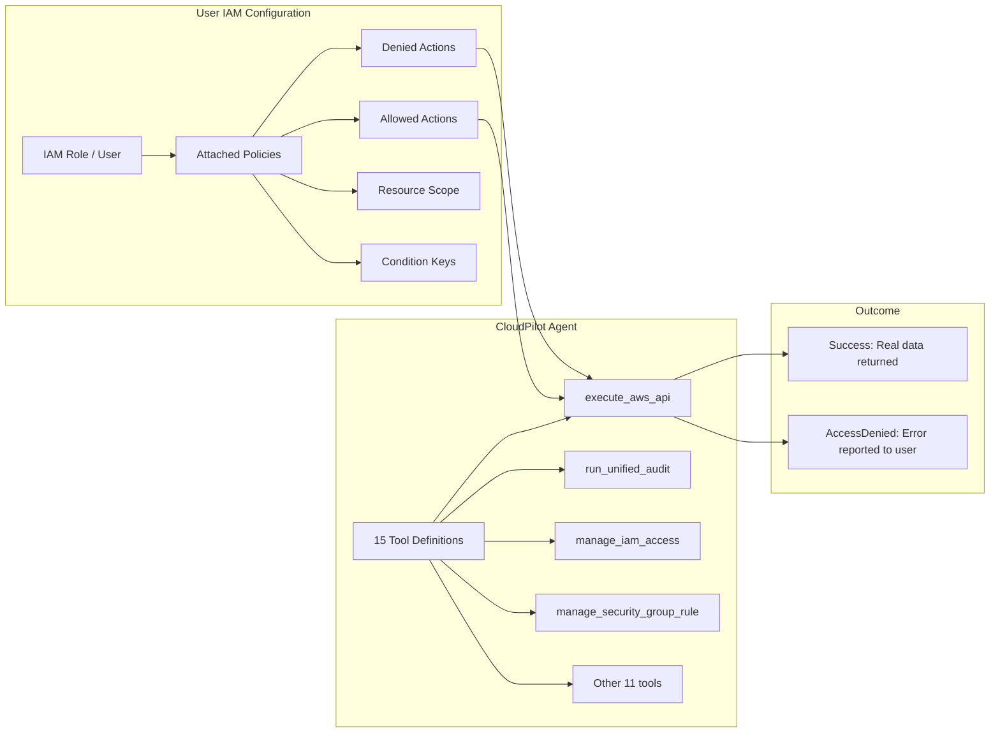

<div align="center">
  <em>Figure 3.2: IAM Permissions as the Agent's Capability Boundary</em>
</div>

**Figure 3.2 Explanation:**

This diagram illustrates that the agent's capabilities are a direct function of the user's IAM configuration. All 15 tools ultimately resolve to AWS SDK calls that execute under the user's credentials. Whether the tool is `execute_aws_api` (direct SDK call), `run_unified_audit` (which internally runs multiple SDK calls), or `manage_security_group_rule` (which calls `ec2:AuthorizeSecurityGroupIngress`), the IAM evaluation is identical—the user's attached policies determine success or failure.

#### Recommended IAM Policy for Read-Only Auditing

For security auditing and compliance scanning (the most common use case), configure an IAM role with the AWS-managed policy **`SecurityAudit`** (ARN: `arn:aws:iam::aws:policy/SecurityAudit`). For comprehensive auditing, also attach **`ViewOnlyAccess`**.

#### Recommended IAM Policy for Attack Simulation

Attack simulations require **write permissions** for creating test resources (IAM users, policies, security groups). Required permissions include: `iam:CreateUser`, `iam:DeleteUser`, `iam:CreateAccessKey`, `iam:DeleteAccessKey`, `iam:AttachUserPolicy`, `iam:DetachUserPolicy`, `iam:PutUserPolicy`, `iam:DeleteUserPolicy`, `ec2:CreateSecurityGroup`, `ec2:DeleteSecurityGroup`, `ec2:AuthorizeSecurityGroupIngress`, `ec2:RevokeSecurityGroupIngress`, `s3:PutBucketPolicy`, `s3:DeleteBucketPolicy`.

#### Permissions Impact Summary

| Agent Capability | Required IAM Permissions | Impact If Missing |
|-----------------|------------------------|-------------------|
| S3 Audit | `s3:ListBuckets`, `s3:GetBucketAcl`, `s3:GetBucketPolicy`, `s3:GetPublicAccessBlock`, `s3:GetBucketEncryption`, `s3:GetBucketVersioning`, `s3:GetBucketLogging` | Partial audit; agent reports AccessDenied per operation |
| IAM Posture | `iam:ListUsers`, `iam:ListAccessKeys`, `iam:GetAccountAuthorizationDetails`, `iam:GetAccountPasswordPolicy`, `iam:ListMFADevices` | Cannot audit IAM |
| EC2 Audit | `ec2:DescribeInstances`, `ec2:DescribeSecurityGroups`, `ec2:DescribeNetworkAcls`, `ec2:DescribeVpcs` | Cannot enumerate instances or network config |
| GuardDuty | `guardduty:ListDetectors`, `guardduty:GetDetector`, `guardduty:ListFindings`, `guardduty:GetFindings` | Cannot check threat detection |
| CloudTrail | `cloudtrail:DescribeTrails`, `cloudtrail:GetTrailStatus`, `cloudtrail:GetEventSelectors` | Cannot verify logging config |
| Unified Audit | All read permissions above plus `ce:GetCostAndUsage`, `cloudwatch:GetMetricStatistics` | Partial or no audit results |
| Attack Simulation | Write permissions on target services | Can enumerate paths (read-only) but cannot execute proof-of-concept |
| Incident Response | `ec2:CreateSecurityGroup`, `ec2:ModifyInstanceAttribute`, `ec2:CreateSnapshot`, `iam:DeactivateAccessKey` | Cannot perform containment |
| Cost Analysis | `ce:GetCostAndUsage`, `cloudwatch:GetMetricStatistics` | Cannot fetch cost data |

### Assume Role Session Details

| Parameter | Value | Purpose |
|-----------|-------|---------|
| `RoleArn` | User-provided ARN | Identifies the IAM role to assume |
| `RoleSessionName` | `CloudPilot-<timestamp>` | Unique session ID for CloudTrail audit trail |
| `DurationSeconds` | `3600` (1 hour) | Temporary credential lifetime |

---

## 4. STS Credential Exchange — Zero Raw Key Transmission

The credential configuration described in Section 3 relies on a critical security mechanism: raw AWS credentials **never reach the AI agent**. This section details the dedicated `aws-exchange-credentials` edge function that implements this protocol.

### Exchange Flow

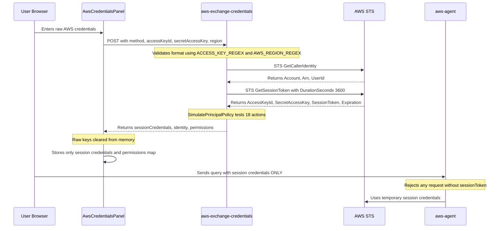

<div align="center">
  <em>Figure 4.1: STS Credential Exchange — Raw Keys Never Reach the Agent</em>
</div>

**Figure 4.1 Explanation:**

This diagram details the exact exchange protocol implemented in `aws-exchange-credentials` (255 lines):

1. **User Input:** The user enters raw credentials in the `AwsCredentialsPanel` component.
2. **Validation & Exchange:** On "Connect", the frontend calls `aws-exchange-credentials`, which validates format, calls `STS:GetCallerIdentity` to verify the credentials, calls `STS:GetSessionToken` (access key method) or `STS:AssumeRole` (role ARN method) for temporary credentials, and runs `SimulatePrincipalPolicy` against 18 actions.
3. **Raw Key Erasure:** After a successful exchange, the frontend clears all raw credential state variables.
4. **Session-Only Transmission:** All subsequent requests to `aws-agent` include only the session credentials. The agent **rejects** any request missing a `sessionToken` field with HTTP 400.
5. **Expiration Handling:** Session tokens expire after 1 hour. The UI displays "Session Expired" and prompts re-authentication.

### Security Properties

| Property | Implementation |
|----------|---------------|
| **Raw keys in transit** | Sent once to `aws-exchange-credentials` over TLS, never to `aws-agent` |
| **Raw keys at rest** | Never stored — cleared from React state after exchange |
| **Session duration** | 1 hour (STS default) |
| **Agent enforcement** | `aws-agent` rejects requests without `sessionToken` with HTTP 400 |
| **Pre-flight checks** | `SimulatePrincipalPolicy` tests 18 actions and returns a permissions map |

### Required IAM Permissions for Exchange

- `sts:GetCallerIdentity` — to validate the credentials
- `sts:GetSessionToken` — to exchange for temporary credentials (access key method)
- `sts:AssumeRole` — only if using the Assume Role method
- `iam:SimulatePrincipalPolicy` — for pre-flight IAM boundary checks (optional; degrades gracefully)

---

## 5. Frontend Architecture

With the backend credential flow established in Sections 3–4, this section details the frontend that presents the user interface, consumes SSE streams, and manages client-side state.

### Technology Stack

| Technology | Purpose |
|-----------|---------|
| React 18 | UI framework |
| Vite | Build tool and dev server |
| TypeScript | Type safety |
| Tailwind CSS | Utility-first styling with custom design tokens |
| shadcn/ui (Radix UI) | Accessible, themeable component primitives |
| react-router-dom | Client-side routing |
| @tanstack/react-query | Async state management (retry: 1, staleTime: 30s) |
| react-markdown + remark-gfm | Markdown rendering with GFM tables |
| framer-motion | Animated panel expand/collapse transitions |
| date-fns | Date formatting and grouping for chat history |
| html2pdf.js | Client-side PDF generation from rendered reports |
| Lucide React | Icon library |

### Pages

| Page | Route | File | Description |
|------|-------|------|-------------|
| Auth | `/auth` | `src/pages/Auth.tsx` | Email/password sign-in and sign-up with email verification |
| Main Interface | `/` | `src/pages/Index.tsx` | Protected route rendering `ChatInterface` |
| Report View | `/report/:id` | `src/pages/Report.tsx` | Read-only historical conversation view with full Markdown rendering and PDF download |
| Reports History | `/reports` | `src/pages/ReportsHistory.tsx` | Searchable, filterable list of past reports with severity badges and date filtering |
| Operations | `/operations` | `src/pages/Operations.tsx` | Unified control plane for event policies, cost rules, drift, runbooks, and org rollouts |
| 404 | `*` | `src/pages/NotFound.tsx` | Fallback for unmatched routes |

### Core Components

| Component | File | Description |
|-----------|------|-------------|
| **ChatInterface** | `src/components/ChatInterface.tsx` | Main workspace. Orchestrates chat layout, input handling, sidebar toggling (credentials, history, findings, quick actions, capabilities list), new chat creation, conversation management, auto-scroll, and S3 report archival. Includes a "Reports" button linking to `/reports` and an "Operations" link to `/operations`. |
| **ChatMessage** | `src/components/ChatMessage.tsx` | Renders individual user/assistant messages. Parses Markdown with `react-markdown` and `remark-gfm`. Includes action buttons: **Download PDF**, **Add to S3**, **View Report**, and **Copy Link**. |
| **ThinkingIndicator** | `src/components/ThinkingIndicator.tsx` | Animated "Agent is thinking..." indicator with three bouncing dots and the CloudPilot logo. |
| **AwsCredentialsPanel** | `src/components/AwsCredentialsPanel.tsx` | Secure form for AWS credential input with framer-motion expand/collapse. Supports Access Key and Assume Role methods. Includes region selector (16 regions), security notice, connection status with masked key preview, and pre-flight permission capability checklist. |
| **QuickActions** | `src/components/QuickActions.tsx` | Provides **55+ pre-built security prompts** organized into **8 color-coded categories**: Audit (blue, 13 actions), Compliance (green, 4 actions), Attack Simulation (red, 11 actions), Incident Response (orange, 6 actions), GuardDuty (pink, 5 actions), Remediation (yellow, 16 actions), Reporting & Alerts (purple, 4 actions), and CloudWatch (cyan, 6 actions). Each prompt populates the input box for review before sending. |
| **FindingsPanel** | `src/components/FindingsPanel.tsx` | Real-time summary of security findings with severity badges (CRIT red, HIGH orange, MED yellow, LOW blue) and aggregate counts. Clickable findings send targeted investigation prompts. |
| **ChatHistoryPanel** | `src/components/ChatHistoryPanel.tsx` | Past conversations grouped by date: **Today**, **Yesterday**, **This Week**, **Older** (using `date-fns`). Supports delete, clear all, and active conversation highlighting. |
| **StatusBar** | `src/components/StatusBar.tsx` | Bottom bar: connection status (pulsing dot), active region, message count, "CloudPilot AI" watermark. |
| **NotificationSettings** | `src/components/NotificationSettings.tsx` | Email configuration for AWS SNS notifications, stored in `localStorage`. |
| **VpcRoutingDialog** | `src/components/VpcRoutingDialog.tsx` | Dialog for VPC endpoint configuration guidance. |
| **CloudPilotLogo** | `src/components/CloudPilotLogo.tsx` | Custom SVG logo: cloud outline with compass rose. |

### Custom Hooks

| Hook | File | Description |
|------|------|-------------|
| `useAuth` | `src/hooks/useAuth.ts` | Manages Supabase Auth session state. Exposes `user`, `loading`, `signIn`, `signUp`, `signOut`. Subscribes to `onAuthStateChange`. |
| `useChat` | `src/hooks/useChat.ts` | Manages active conversation messages. Loads from DB, sends to edge function, consumes SSE stream via `ReadableStream` reader with `TextDecoder`, line-by-line parser for `data:` events and `[DONE]` termination. Persists messages on completion. |
| `useChatHistory` | `src/hooks/useChatHistory.ts` | CRUD on `conversations` table. Provides `fetchConversations`, `createConversation`, `updateTitle`, `deleteConversation`, `clearAllHistory`, `touchConversation`. |

### Design System

The UI follows a **"Tactical Clarity"** design philosophy—dark charcoal backgrounds with emerald green accents, monospace typography (JetBrains Mono for code, Inter for body), and high-density SOC-grade layouts. Custom CSS variables in `src/index.css` define:

- **Severity colors:** `--severity-critical` (red), `--severity-high` (orange), `--severity-medium` (yellow), `--severity-low` (blue)
- **Terminal aesthetics:** `--terminal` background color for code blocks
- **Semantic tokens:** `--background`, `--foreground`, `--primary`, `--muted`, `--accent`, `--destructive`
- **Custom animations:** `pulse-dot` for connection indicator, `glow-primary` for logo halo

---

## 6. Backend Orchestration — The `aws-agent` Edge Function

The frontend architecture described in Section 5 communicates primarily with a single backend entry point: the `aws-agent` edge function. This section details its internal logic, system prompt engineering, and agentic loop mechanics.

The `aws-agent` edge function (`supabase/functions/aws-agent/index.ts`, 1,337 lines) runs on Deno, guaranteeing ephemeral, isolated compute per request. It employs a **two-model architecture**: a fast intent classifier (Gemini 2.5 Flash Lite) determines the query domain, followed by the main agentic model (Gemini 2.5 Flash) operating with only the relevant tool subset.

### Core Responsibilities

1. **Input Validation** — Validates message arrays (max 100), content lengths (max 50,000 chars), credential formats via regex, and requires `sessionToken`
2. **Intent Classification** — Uses Gemini 2.5 Flash Lite for a single-shot classification of user intent into one of 9 categories, selecting only the relevant tool subset
3. **System Prompt Injection** — Constructs the AI context with Zero Simulation Tolerance rules, tool usage protocols (scoped to classified intent), attack simulation lifecycle, output format mandates, S3 archival instructions, and SNS notification instructions
4. **Agentic Tool-Call Loop** — Up to 15 iterations of AI-tool interactions using Gemini 2.5 Flash with the filtered tool set, dispatching all tool calls to `aws-agent-tools` in batched requests
5. **SSE Streaming** — Streams the final Markdown response as 30-character chunks at 8ms intervals

### Intent Router — LLM-Based Tool Selection

Before entering the agentic loop, `aws-agent` invokes Gemini 2.5 Flash Lite (the fastest, cheapest model) to classify the user's intent into one of 9 categories. Based on this classification, only the relevant tools are included in the main agent's context, reducing token usage and improving accuracy.

| Intent | Tool Subset | Example Queries |
|--------|-------------|-----------------|
| `security_audit` | `execute_aws_api`, `run_unified_audit`, `manage_security_group_rule`, `manage_iam_access` | "Audit my S3 buckets", "Check my security posture" |
| `cost_analysis` | `execute_aws_api`, `run_cost_anomaly_scan`, `manage_cost_rule` | "Where am I wasting money?", "Alert if spend > $200" |
| `drift_detection` | `execute_aws_api`, `manage_drift_baseline`, `run_drift_detection` | "Capture baseline", "Show overnight drift" |
| `org_management` | `execute_aws_api`, `run_org_query`, `manage_org_operation` | "Which accounts lack MFA?", "Apply SCP to dev accounts" |
| `ops_automation` | `execute_aws_api`, `manage_runbook_execution`, `manage_security_group_rule`, `manage_iam_access` | "Run incident response", "Run playbook", "Confirm" |
| `attack_simulation` | `execute_aws_api`, `run_attack_simulation`, `run_evasion_test` | "Simulate privilege escalation", "Test evasion" |
| `event_automation` | `execute_aws_api`, `manage_event_response_policy`, `replay_cloudtrail_events` | "If anyone opens port 22, close it", "Replay last 24h" |
| `direct_query` | `execute_aws_api` | "List my S3 buckets", "Show EC2 instances" |
| `general` | All 15 tools | Ambiguous or multi-domain queries |

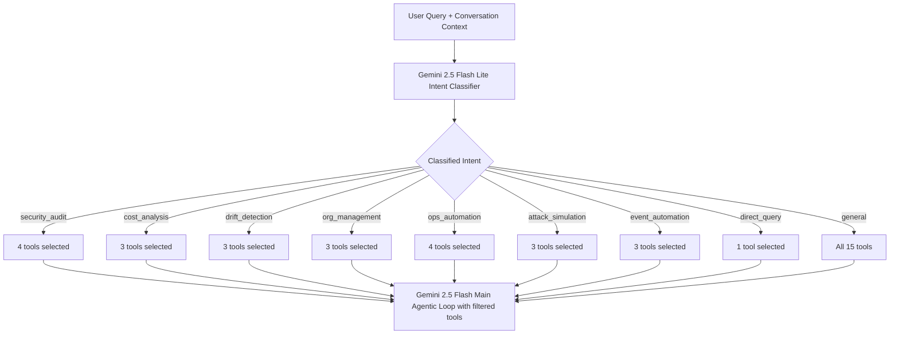

<div align="center">
  <em>Figure 6.1: Intent Router — LLM-Based Tool Selection Before the Agentic Loop</em>
</div>

**Figure 6.1 Explanation:**

This diagram shows the two-stage model architecture:

1. **Classification Stage:** The user's latest message and last 3 conversation messages are sent to Gemini 2.5 Flash Lite with a structured classification prompt. The model returns a single category string (e.g., `security_audit`). If classification fails (network error, invalid response), the system falls back to `general` which includes all 15 tools.

2. **Tool Filtering:** The classified intent maps to a pre-defined tool subset via `INTENT_TOOL_MAP`. For example, a cost query only sees `execute_aws_api`, `run_cost_anomaly_scan`, and `manage_cost_rule` — 3 tools instead of 15. This reduces the tool definition tokens by ~80% for focused queries.

3. **Main Agent:** Gemini 2.5 Flash receives the full system prompt, conversation history, and the **filtered** tool set. It then enters the standard agentic loop (up to 15 iterations).

**Why Gemini 2.5 Flash Was Chosen:**

The model selection for CloudPilot AI was driven by three operational requirements specific to an agentic security tool:

- **Latency sensitivity:** Security operations demand fast response times. Gemini 2.5 Flash provides the lowest latency among models with strong tool-calling capabilities, critical for an agentic loop that may iterate up to 15 times per query. Each iteration adds round-trip latency, so a slower model (e.g., GPT-5 or Gemini 2.5 Pro) would compound delays across iterations, making complex audits impractical.

- **Tool-calling accuracy at scale:** CloudPilot exposes 15 complex tools with nested JSON schemas. Gemini 2.5 Flash demonstrates high accuracy in structured tool-call generation while maintaining sub-second inference times — a balance that larger models achieve at 3-5x the cost and latency.

- **Cost efficiency for high-volume usage:** Security teams run dozens of queries per session, each consuming multiple tool-call iterations. Gemini 2.5 Flash costs ~80% less per token than Pro-tier models, making sustained usage economically viable. The two-model architecture further optimizes this: Gemini 2.5 Flash Lite (the cheapest, fastest tier) handles the single-shot classification at ~10x lower cost, while Flash handles the reasoning-intensive agentic loop.

- **Sufficient reasoning depth:** While Pro-tier models offer marginally better reasoning on ambiguous queries, CloudPilot's system prompt and tool-call protocols are highly structured — the model follows deterministic workflows rather than open-ended reasoning. This structured context compensates for any reasoning gap, making Flash's capability level the optimal cost-performance sweet spot.

### System Prompt Engineering

The system prompt is 575 lines of meticulously crafted instructions embedded directly in `aws-agent/index.ts`:

| Section | Purpose |
|---------|---------|
| Zero Simulation Tolerance | Mandates tool calls before ANY findings. States: "Any response containing findings that were not retrieved via execute_aws_api is a critical failure." |
| Tool Usage Protocols | 7 separate protocol blocks: execute_aws_api, manage_iam_access, manage_security_group_rule, run_unified_audit, cost automation, drift detection, organizations, runbooks, event policies, attack simulation |
| Attack Simulation Lifecycle | 4-phase protocol: Tagging, Tracking, Completion Block, Cleanup |
| Capabilities | 6 capability domains with sub-bullets covering 35+ services |
| Output Format (Mandatory) | 8-section industry-grade report template: Header, Executive Summary, Assessment Scope, Risk Matrix, Findings Table, Detailed Findings, Compliance Mapping, Remediation Priority |
| S3 Report Archival | 5-step automatic archival protocol |
| SNS Email Notification | 5-step automatic email notification protocol |

### Tool Definitions

The edge function exposes **15 tools** to the LLM:

| Tool | Routed To | Purpose |
|------|-----------|---------|
| `execute_aws_api` | Scanner | Direct AWS SDK API call (any of 35+ services) |
| `run_unified_audit` | Scanner | Formal unified audit with classification and scanners |
| `run_cost_anomaly_scan` | Scanner | Cost data fetch, anomaly detection, idle EC2 analysis |
| `manage_cost_rule` | Scanner | Natural-language cost rule parsing and storage |
| `manage_drift_baseline` | Scanner | Baseline capture or drift acknowledgement |
| `run_drift_detection` | Scanner | Live snapshot vs baseline comparison |
| `manage_iam_access` | Ops | IAM policy preview and guarded execution |
| `manage_security_group_rule` | Ops | SG rule preview with risk classification |
| `run_org_query` | Ops | Read-only AWS Organizations queries (6 query types) |
| `manage_org_operation` | Ops | Guarded org-wide write operations (SCP rollout) |
| `manage_runbook_execution` | Ops | Runbook resolve, plan, dry-run, execute, resume |
| `manage_event_response_policy` | Ops | Event response policy create/list |
| `replay_cloudtrail_events` | Ops | CloudTrail replay against policies |
| `run_attack_simulation` | Ops | AI-vs-AI attack simulation with dynamic path mapping |
| `run_evasion_test` | Ops | Detection evasion testing module |

### Agentic Loop Mechanics

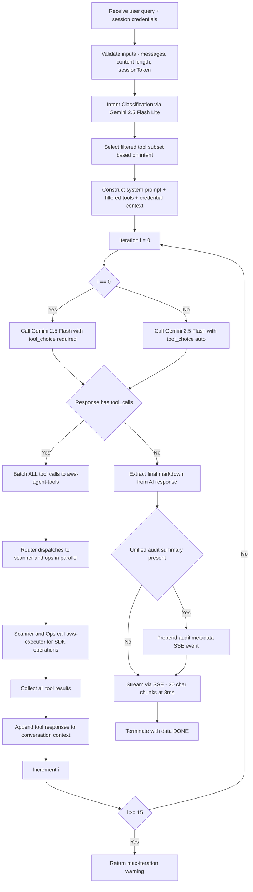

<div align="center">
  <em>Figure 6.2: Agentic Tool-Call Loop — Complete Decision Flow with Intent-Based Tool Filtering</em>
</div>

**Figure 6.2 Explanation:**

This flowchart details the exact decision logic inside the agentic loop, including the new intent-based routing:

1. **Entry:** The edge function receives validated session credentials (must include `sessionToken`).

2. **Intent Classification:** Before entering the agentic loop, the user's query (with last 3 messages for context) is sent to Gemini 2.5 Flash Lite for intent classification. This takes ~100-200ms and returns one of 9 categories. On failure, falls back to `general` (all tools).

3. **Tool Filtering:** The classified intent maps to a filtered tool subset. For example, `cost_analysis` includes only 3 tools instead of 15, reducing prompt tokens significantly.

4. **Context Construction:** The 575-line system prompt is combined with sanitized conversation history, a credential context string showing the masked key and active region, and the **filtered** tool definitions.

5. **Iteration Control:** The loop runs up to 15 iterations (`MAX_ITERATIONS = 15`). On iteration 0, `tool_choice` is `"required"`. On all subsequent iterations, `tool_choice` is `"auto"`. The main model is Gemini 2.5 Flash.

6. **Batched Tool Dispatch:** When the AI returns tool calls, ALL calls in the response are sent in a single POST to `aws-agent-tools`. This is a key architectural decision — it avoids multiple round trips and enables the router to parallelize scanner and ops calls.

7. **Audit Metadata:** If any tool result contains a `auditSummary` field (from `run_unified_audit`), it is captured and prepended as a metadata SSE event before the main content stream. The frontend uses this to populate the findings panel.

8. **Loop Termination:** Normal exit when AI returns content without tool calls. Max iterations returns: "Agent reached the maximum number of API iterations. Try narrowing your request." AI gateway errors (429, 402, 500) are returned immediately.

---

## 7. Edge Function Decomposition — Router, Scanner, Ops, and Executor

Section 6 described how `aws-agent` dispatches tool calls to `aws-agent-tools`. This section explains why the tool execution layer was decomposed into four separate edge functions and how they collaborate.

### Why Decomposition Was Necessary

The original `aws-agent-tools` function contained all tool logic plus all 35+ `@aws-sdk/client-*` imports in a single file. This caused **bundle generation timeouts** during deployment because the Supabase bundler could not process the massive dependency tree within its time limit. The solution was a three-part decomposition:

1. **`aws-agent-tools`** became a thin router (75 lines) with zero AWS SDK dependencies
2. **`aws-agent-scanner`** (2,987 lines) handles scanner tools
3. **`aws-agent-ops`** (4,572 lines) handles operational tools
4. **`aws-executor`** (104 lines) became the single point of AWS SDK v3 import

### Architecture

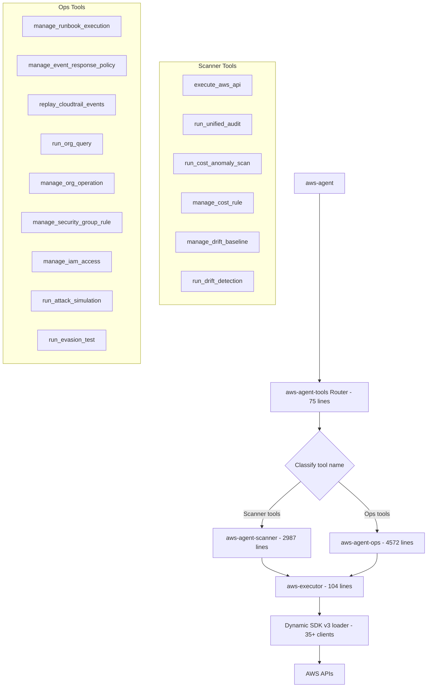

<div align="center">
  <em>Figure 7.1: Edge Function Decomposition — Router, Scanner, Ops, and Executor</em>
</div>

**Figure 7.1 Explanation:**

This diagram shows the decomposed tool execution architecture:

- **Router (`aws-agent-tools`, 75 lines):** Receives a batch of tool calls from `aws-agent`. Classifies each by name using two sets: `SCANNER_TOOLS` and `OPS_TOOLS`. Dispatches scanner and ops calls in **parallel** using `Promise.all`, then merges results.

- **Scanner (`aws-agent-scanner`, 2,987 lines):** Contains the unified audit engine (IAM, S3, security group, EC2, cost scanners), cost anomaly detection (statistical spike detection, threshold breach detection), drift detection (snapshot capture, fingerprint comparison, structured diffing, severity scoring), and the `execute_aws_api` tool with service allowlist and operation blocklist enforcement.

- **Ops (`aws-agent-ops`, 4,572 lines):** Contains IAM automation (least-privilege policy generation, blocked action validation, confirm-before-execute), security group automation (risk classification, hard-block rules, preview-before-apply), runbook execution engine (resolve, plan, dry-run, execute, resume, abort), AWS Organizations queries and guarded SCP rollout, event response policies, CloudTrail replay, attack simulation, and evasion testing.

- **Executor (`aws-executor`, 104 lines):** The single AWS SDK v3 import point. Maps 35 service names to their `@aws-sdk/client-*` package names via `_awsSvcMap`. Dynamically loads packages using `import("npm:@aws-sdk/client-" + pkg + "@3.744.0")` with in-memory caching. Receives `{service, commandName, config, params}`, instantiates the client, creates the command, and returns the result. Uses `status: 200` for errors so callers can parse error details.

### AWS SDK Proxy Pattern

Both `aws-agent-scanner` and `aws-agent-ops` use an identical proxy pattern to call `aws-executor`:

```typescript
// awsExec: Direct v3 send via proxy
async function awsExec(service, commandName, config, params) {
  const resp = await fetch(EXECUTOR_URL, {
    method: "POST",
    headers: { Authorization: `Bearer ${SERVICE_ROLE_KEY}` },
    body: JSON.stringify({ service, commandName, config, params }),
  });
  const data = await resp.json();
  if (data.error) throw new Error(data.error);
  return data.result;
}

// v2Client: Proxy wrapper for v2-style method calls
function v2Client(service, config) {
  return new Proxy({}, {
    get(_, method) {
      return (params) => ({
        promise: () => awsExec(service, method[0].toUpperCase() + method.slice(1) + "Command", config, params),
      });
    },
  });
}
```

This pattern allows the thousands of lines of business logic in scanner and ops to call AWS APIs using either v2-compatible syntax (`v2Client("IAM", config).listUsers({}).promise()`) or direct v3 syntax (`v3Send("IAM", "ListUsersCommand", config, {})`) without importing any SDK packages themselves.

---

## 8. AWS Services & Capabilities

With the full backend architecture established in Sections 6–7, this section enumerates the exact services and capability domains available to the agent.

### Allowed AWS Services (35 Services)

The `aws-executor` maps 35 service names to their SDK packages. The `aws-agent-scanner` enforces a `ALLOWED_AWS_SERVICES` set that restricts the AI to these services only:

| Category | Services | Count |
|----------|----------|-------|
| **Identity & Access** | IAM, STS, Organizations, CognitoIdentityServiceProvider | 4 |
| **Compute** | EC2, Lambda, ECS, EKS, AutoScaling | 5 |
| **Storage** | S3, ECR | 2 |
| **Database** | RDS, DynamoDB, ElastiCache, Redshift | 4 |
| **Networking** | CloudFront, Route53, ELBv2, APIGateway, NetworkFirewall, Shield | 6 |
| **Security & Compliance** | GuardDuty, SecurityHub, Inspector2, AccessAnalyzer, Macie2, WAFv2, ACM, KMS | 8 |
| **Monitoring & Logging** | CloudTrail, Config, CloudWatch, CloudWatchLogs, EventBridge | 5 |
| **Secrets & Config** | SecretsManager, SSM | 2 |
| **Messaging** | SNS, SQS | 2 |
| **Orchestration & Analytics** | StepFunctions, Athena, CostExplorer | 3 |

### Blocked Operations

The following operations are permanently blocked regardless of user permissions:

| Operation | Reason |
|-----------|--------|
| `closeAccount` | Irreversible account closure |
| `leaveOrganization` | Removes account from Organization |
| `deleteOrganization` | Destroys organizational structure |
| `createAccount` | Prevents unauthorized account creation |
| `inviteAccountToOrganization` | Prevents unauthorized org changes |

### Capability Domains

#### 1. Security Auditing
Full configuration analysis across all 35 services covering: IAM (users, roles, policies, access keys, MFA, permission boundaries, SCPs), S3 (ACLs, policies, public access blocks, encryption, versioning, logging, replication), EC2 (security groups, NACLs, public IPs, IMDSv2, EBS encryption, AMI exposure, launch templates), VPC (flow logs, route tables, internet gateways, NAT gateways, peering, PrivateLink), RDS/Aurora (public accessibility, encryption, backup retention, deletion protection), Lambda (policies, env vars, execution roles, VPC config, layer exposure), ECS/EKS (task roles, network mode, privileged containers), CloudTrail (trail status, validation, S3 delivery, KMS encryption), Config (recorder, rules, conformance packs), GuardDuty (detector status, findings, S3/EKS/Lambda/RDS protection), Security Hub (standards, findings, insights), KMS (rotation, policies, grants), Secrets Manager/SSM (resource policies, rotation), Organizations (SCPs, delegated admins), ACM (expiry, key algorithm), WAF (web ACLs, rules, IP sets), CloudFront (OAI/OAC, HTTPS enforcement), API Gateway (auth, resource policies), SNS/SQS (policies, encryption), ECR (scanning, lifecycle), Cognito (MFA, advanced security), and Log Analysis (CloudTrail and CloudWatch log parsing).

#### 2. Attack Simulation & Autonomous Defense
All simulations execute real API calls and follow the 4-phase Attack Simulation Lifecycle. Includes:
- **AI-vs-AI Attack Simulation** with Dynamic Attack Path Mapping and Unified Risk Scoring
- **AI Evasion Testing Module** for identifying detection blind spots
- **Privilege Escalation** (11 techniques: CreatePolicyVersion, AttachUserPolicy, PassRole abuse, etc.)
- **Credential & Secrets Exposure** (EC2 user data, Lambda env vars, SSM, Secrets Manager)
- **S3 Data Exfiltration** (public access, cross-account policies, pre-signed URL abuse)
- **Lateral Movement** (VPC peering, instance profiles, Lambda roles, ECS task roles)
- **Detection Evasion** (GuardDuty gaps, CloudTrail exclusions, CloudWatch alarm coverage)
- **Network Attack Surface** (0.0.0.0/0 ingress, exposed databases, SSRF paths)
- **Supply Chain & Third-Party Risk** (cross-account roles, external principals)

#### 3. Incident Response
- **Autonomous Runbooks:** Multi-step containment (snapshot, isolate, revoke, preserve)
- Live instance isolation (quarantine SG, snapshot, IMDS disable)
- Credential revocation (deactivate keys, detach policies)
- Forensic evidence preservation (CloudTrail, VPC Flow Logs, S3 access logs)
- Threat hunting and blast radius assessment

#### 4. Remediation & Automation
- Exact AWS CLI commands targeting real resource IDs
- Policy documents for MFA enforcement, least privilege
- Service enablement commands (GuardDuty, Config, CloudTrail)
- Configuration hardening (IMDSv2, S3 Block Public Access, encryption)
- Task automator mapping Security Hub/GuardDuty findings to runbooks

#### 5. Reporting & Alerts
- Report Builder for structured findings reports
- Severity alert configuration auditing
- Audit archive verification (WORM/Object Lock)
- Email engine auditing (SES, SNS-to-Email)

#### 6. CloudWatch Automation
- Security alarm creation, metric filters, anomaly detection, Log Insights queries, dashboard generation (detailed in Section 22)

---

## 9. Quick Actions — Pre-Built Security Workflows

The capabilities described in Section 8 are directly exposed to users through pre-built quick action prompts. CloudPilot AI provides **55+ pre-built quick action prompts** organized into **8 color-coded categories**. Each prompt is carefully engineered with specific API call instructions to ensure Zero Simulation Tolerance.

**Behavior:** When a user clicks a quick action button, the prompt is **populated into the message input box** rather than being sent immediately. This allows the user to review, modify, or augment the prompt before sending. The textarea auto-focuses and auto-resizes to display the full prompt.

### Categories

| Category | Color | Count | Example Actions |
|----------|-------|-------|----------------|
| **AUDIT** | Blue (`text-blue-400`) | 13 | S3 Buckets, Unified Audit, Cost Anomalies, Drift Digest, Org MFA Gaps, Org SCP Inventory, Runbook Dry Run, IAM Posture, Security Groups, EC2 Instances, RDS/Aurora, Lambda Security, IP Safety Check, Log Analyst |
| **COMPLIANCE** | Green (`text-green-400`) | 4 | CIS Benchmark, CloudTrail, GuardDuty, Security Hub |
| **ATTACK SIMULATION** | Red (`text-red-400`) | 11 | Privilege Escalation, Secrets Exposure, S3 Exfil Paths, Lateral Movement, Detection Gaps, Network Exposure, Threat Detector, Auto Pen Test, AI vs AI Sim, Evasion Test, Auto Defense |
| **INCIDENT RESPONSE** | Orange (`text-orange-400`) | 6 | Isolate Instance, Credential Audit, Forensic Snapshot, Blast Radius, Block IPs, Revoke IAM |
| **GUARDDUTY** | Pink (`text-pink-400`) | 5 | Threat Hunting, Coverage Gap Analysis, Malware Scans, EKS & Container Threats, IAM Credential Theft |
| **REMEDIATION** | Yellow (`text-yellow-400`) | 16 | Close Public Access, SG Preview 443, SG-to-SG Preview, SG Block Test, SG Egress Preview, SG Revoke Egress, Confirm Change, Capture Baseline, Org SCP Preview, Guardian Role Status, S3 Lockdown Runbook, Enable GuardDuty, Enforce MFA, IAM S3 Preview, IAM Scoped Preview, Harden IMDSv2, Task Automator, Set $200 Budget Rule, Auto-Stop Idle EC2 |
| **REPORTING & ALERTS** | Purple (`text-purple-400`) | 4 | Report Builder, Severity Alerts, Audit Archive, Email Engine |
| **CLOUDWATCH** | Cyan (`text-cyan-400`) | 6 | Security Alarms, Anomaly Detection, Log Insights, Metric Filters, Security Dashboard, Alarm Status |

---

## 10. Security & Safety Mechanisms

The quick actions and tool definitions from Sections 8–9 operate within a strict security framework. This section describes the defense-in-depth mechanisms that prevent misuse.

### Defense-in-Depth Layers

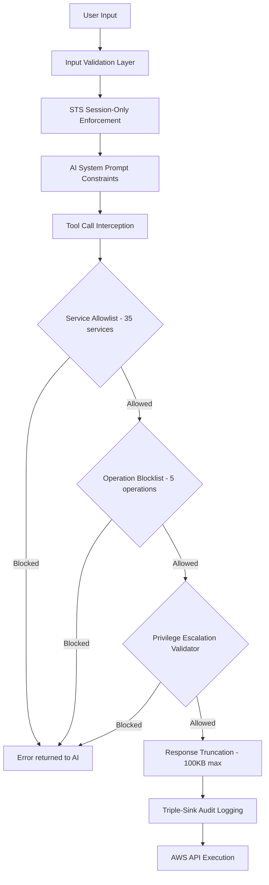

<div align="center">
  <em>Figure 10.1: Defense-in-Depth Security Layers — Every Tool Call Passes Through Six Validation Gates</em>
</div>

**Figure 10.1 Explanation:**

This flowchart shows the six security layers every tool call must pass through:

1. **Input Validation Layer:** Message array size (max 100), content length (max 50,000 chars), credential format regex, control character sanitization.

2. **STS Session-Only Enforcement:** `aws-agent` rejects any request without a `sessionToken` field, ensuring raw credentials never reach the agent.

3. **AI System Prompt Constraints:** The 575-line system prompt explicitly prohibits simulation, fabrication, and provides strict tool usage protocols.

4. **Service Allowlist:** The `ALLOWED_AWS_SERVICES` set contains 35 approved services. Any request to an unlisted service is rejected with an error returned to the AI.

5. **Operation Blocklist:** The `BLOCKED_OPERATIONS` set contains 5 permanently blocked destructive operations (see Section 8).

6. **Response Truncation:** AWS API responses exceeding 100,000 characters are truncated with `[TRUNCATED]` marker.

After all gates pass, the call is logged to three audit sinks (detailed in Section 12) before execution.

---

## 11. Privilege Escalation Validator

As a specialized gate within the security framework described in Section 10, the privilege escalation validator provides an additional check specifically for IAM automation operations.

### IAM Blocked Actions

The `IAM_BLOCKED_ACTIONS` set in `aws-agent/index.ts` prevents the AI from generating policies containing dangerous actions:

```
*, iam:*, iam:CreateUser, iam:AttachUserPolicy, iam:PutUserPolicy, iam:PassRole, sts:AssumeRole
```

### Confirmation Enforcement

IAM mutations and security group changes require explicit user confirmation. The `isExplicitConfirmation()` function checks the latest user message against a list of approved confirmation phrases:

```
confirm, yes, approve, do it, proceed, execute, go ahead, run it, apply, run playbook
```

Additionally, `IAM_CONFIRM_PATTERNS` provides regex-based matching: `confirm`, `confirm apply`, `apply`, `proceed`, `approved`, `yes apply`, `yes confirm`.

The `userHasConfirmedMutation` flag is passed to `aws-agent-tools` with every batch dispatch, ensuring that only confirmed mutations are executed.

---

## 12. Agent Audit Log — Triple-Sink Architecture

With the security mechanisms established in Sections 10–11, this section describes how every tool execution is permanently recorded across three independent audit sinks for comprehensive accountability.

### Sink 1: Supabase Audit Table (Platform-Side)

| Property | Value |
|----------|-------|
| **Table** | `agent_audit_log` |
| **Columns** | `id`, `user_id`, `aws_service`, `aws_operation`, `aws_region`, `status`, `validator_result`, `execution_time_ms`, `error_code`, `error_message`, `params_hash`, `conversation_id`, `created_at` |
| **RLS** | Users can SELECT own logs (`auth.uid() = user_id`); only service role can INSERT |
| **Params storage** | Parameters are hashed (Base64 of first 200 chars) — full params stored only in user's WORM bucket |

### Sink 2: CloudWatch Logs (User's AWS Account)

| Property | Value |
|----------|-------|
| **Log Group** | `/cloudpilot/agent-audit` |
| **Log Stream** | `agent-YYYY-MM-DD` (daily rotation) |
| **Payload** | JSON: `{timestamp, userId, service, operation, region, params, status, validatorResult, executionTimeMs, errorCode?, errorMessage?}` |
| **Setup** | Fully automatic — log group and stream created idempotently |
| **Required IAM** | `logs:CreateLogGroup`, `logs:CreateLogStream`, `logs:PutLogEvents`, `logs:DescribeLogStreams` |

### Sink 3: WORM S3 (User's AWS Account)

| Property | Value |
|----------|-------|
| **Bucket Name** | `cloudpilot-audit-worm-{aws-account-id}` |
| **Object Lock Mode** | `COMPLIANCE` (cannot be overridden, even by root) |
| **Default Retention** | 365 days |
| **Encryption** | AES-256 (SSE-S3) |
| **Public Access** | Fully blocked |
| **Key Format** | `audit/YYYY-MM-DD/YYYY-MM-DDTHH-mm-ss.sssZ-{uuid}.json` |
| **Required IAM** | `s3:CreateBucket`, `s3:PutBucketObjectLockConfiguration`, `s3:PutBucketEncryption`, `s3:PutPublicAccessBlock`, `s3:PutObject` |

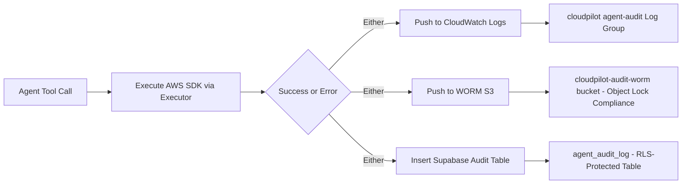

<div align="center">
  <em>Figure 12.1: Triple-Sink Audit Architecture — Every Agent Action Recorded to CloudWatch, WORM S3, and Database Simultaneously</em>
</div>

**Figure 12.1 Explanation:**

Every tool execution (success or error) is recorded to all three sinks simultaneously. The sinks are independent — failure in one does not prevent recording in others. CloudWatch/S3 failures are caught and logged but never break the agent flow.

### What Gets Logged

| Event | `status` | `validator_result` | Details |
|-------|---------|-------------------|---------|
| Successful API call | `success` | `ALLOWED` or `HIGH_RISK` | Service, operation, region, execution time |
| Permission denied | `error` | `ALLOWED` | AWS error code and IAM policy snippet |
| Validator blocked | `blocked` | `BLOCKED` | Reason for blocking |
| SDK error | `error` | varies | Error code + message (truncated to 2000 chars) |

---

## 13. Authentication & User Management

The audit logging described in Section 12 relies on authenticated user IDs to scope log access. This section describes the authentication system.

### Implementation

| Feature | Implementation |
|---------|---------------|
| Sign Up | `supabase.auth.signUp()` — requires email verification |
| Sign In | `supabase.auth.signInWithPassword()` |
| Sign Out | `supabase.auth.signOut()` |
| Session Management | `onAuthStateChange()` listener in `useAuth` hook |
| Protected Routes | `ProtectedRoute` wrapper redirects to `/auth` if unauthenticated |
| Loading State | Branded loading screen (logo + spinner) |

### Auth Page (`/auth`)
- Mode toggle between **Sign In** and **Create Account** tabs
- Password visibility toggle
- Error display with destructive red styling
- Success message after signup: "Account created! Check your email to confirm your address, then sign in."
- Footer security note: "Your AWS credentials are never stored."

---

## 14. Chat History & Persistence

With authentication established in Section 13, all data access is scoped to the authenticated user. This section describes the database schema and chat persistence mechanics.

### Database Schema

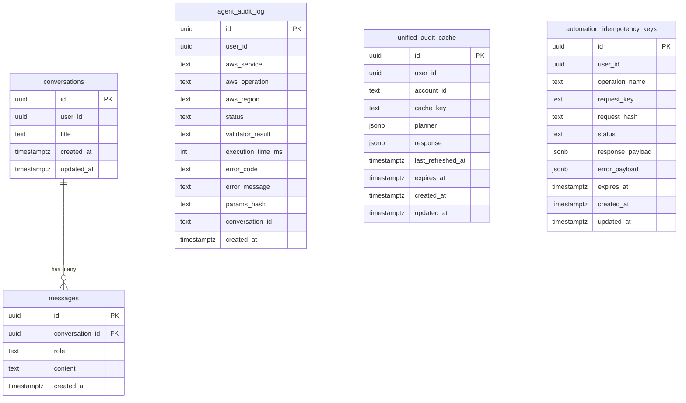

<div align="center">
  <em>Figure 14.1: Database Schema — All Five Supabase Tables</em>
</div>

**Figure 14.1 Explanation:**

This entity-relationship diagram shows all five Supabase database tables:

- **conversations:** Chat sessions per user. Title auto-generated from first message (truncated to 65 chars). `updated_at` refreshed on every new message for recency ordering.

- **messages:** Individual messages within conversations. `role` is `"user"` or `"assistant"`. `conversation_id` FK with `ON DELETE CASCADE`. Ordered by `created_at` ascending.

- **agent_audit_log:** Audit records for every tool execution (detailed in Section 12).

- **unified_audit_cache:** Caches unified audit results per account with expiration. Keyed by `cache_key` (account + audit type). Stores the planner (which scanners ran) and full response.

- **automation_idempotency_keys:** Prevents duplicate execution of automation operations. Stores operation name, request hash, status (`pending`, `completed`, `failed`), and response/error payloads. Expires after 24 hours.

### Row-Level Security (RLS)

| Table | Operations | Policy Expression |
|-------|-----------|-------------------|
| `conversations` | SELECT, INSERT, UPDATE, DELETE | `auth.uid() = user_id` |
| `messages` | SELECT, INSERT, DELETE | `EXISTS (SELECT 1 FROM conversations WHERE id = conversation_id AND user_id = auth.uid())` |
| `agent_audit_log` | SELECT (authenticated), INSERT (service_role only) | Users: `auth.uid() = user_id`; Service: `true` |
| `unified_audit_cache` | SELECT (authenticated), ALL (service_role) | Users: `auth.uid() = user_id`; Service: `true` |
| `automation_idempotency_keys` | SELECT (authenticated), ALL (service_role) | Users: `auth.uid() = user_id`; Service: `true` |

### Chat History Features

| Feature | Implementation |
|---------|---------------|
| Auto-create conversation | On first message, `conversations` record created with query as title |
| Message persistence | User and assistant messages inserted immediately |
| History listing | Sorted by `updated_at` desc, grouped: Today, Yesterday, This Week, Older |
| Resume conversation | Sets `currentConvId`, triggering message reload |
| Delete conversation | Cascade deletes all messages; clears chat if active |
| Clear all history | Deletes all conversations for user |
| Touch on activity | `updated_at` refreshed, list re-sorted client-side |

---

## 15. Output Formatting & Markdown Rendering

The messages persisted in Section 14 contain structured Markdown produced by the AI. This section describes the mandatory output format and rendering pipeline.

### AI Output Structure

Every AI response follows a mandatory 8-section industry-grade report format enforced by the system prompt:

1. **Report Header** — Report ID, date, account ID, region, classification, distribution
2. **Executive Summary** — 5–8 sentence formal overview
3. **Assessment Scope and Methodology** — Services, resources, frameworks, limitations
4. **Risk Summary Matrix** — Counts by severity tier with overall risk rating
5. **Findings Summary Table** — Ref, Resource ARN, Service, Description, Severity, Compliance Impact
6. **Detailed Findings** — Per-finding: Classification, Description, Evidence (real API JSON), Risk/Impact Analysis, Remediation (AWS CLI), Verification
7. **Compliance Mapping Matrix** — Finding mapped to 16+ frameworks
8. **Remediation Priority Matrix** — Prioritized by effort and business impact

### Rendering Stack

| Component | Purpose |
|-----------|---------|
| `react-markdown` | Parses Markdown into React elements |
| `remark-gfm` | GFM plugin — pipe tables, strikethrough, autolinks |
| Custom CSS | Terminal-aesthetic `<table>`, `<code>`, `<pre>` styling |
| `html2pdf.js` | Client-side PDF generation from rendered reports |

### Severity Ratings

| Severity | Color | Use Case |
|----------|-------|----------|
| **CRITICAL** | Red | Actively exploitable, immediate risk |
| **HIGH** | Orange | Significant risk requiring prompt attention |
| **MEDIUM** | Yellow | Moderate risk |
| **LOW** | Blue | Minor risk, best practice |
| **INFO** | Gray | Informational |

---

## 16. API Limits & Rate Limiting

The rendering pipeline described in Section 15 operates within strict operational limits. This section enumerates all limits enforced across the system.

### Edge Function Limits

| Limit | Value | Enforcement Point | Impact When Exceeded |
|-------|-------|-------------------|---------------------|
| Max messages per request | 100 | `aws-agent` input validation | HTTP 400 |
| Max message content length | 50,000 chars | `aws-agent` input validation | HTTP 400 |
| Max agentic loop iterations | 15 | `aws-agent` loop counter | Warning message returned |
| Max AWS API response size | 100,000 chars | `aws-agent-scanner` post-SDK truncation | `[TRUNCATED]` marker |
| SSE chunk size | 30 chars | `aws-agent` streaming | N/A |
| SSE chunk interval | 8ms | `aws-agent` streaming | N/A |
| STS session duration | 3,600 seconds | `aws-exchange-credentials` | Must reconnect |

### AI Gateway Rate Limits

| HTTP Status | Meaning | User-Facing Error |
|-------------|---------|-------------------|
| 429 | Rate limit exceeded | "Rate limit exceeded." |
| 402 | Credits exhausted | "AI usage credits exhausted." |
| 500 | Internal error | "AI service error" |

### Input Validation Limits

| Input | Validation | Max Length |
|-------|-----------|------------|
| AWS Region | `/^[a-z]{2}(-[a-z]+-\d+)?$/` | 30 chars |
| Access Key ID | `/^[A-Z0-9]{16,128}$/` | 128 chars |
| Secret Access Key | String sanitization | 256 chars |
| Session Token | String sanitization | 2,048 chars |
| Role ARN | `/^arn:aws:iam::\d{12}:role\/[\w+=,.@\/-]+$/` | 256 chars |
| Message role | Must be `"user"` or `"assistant"` | — |

---

## 17. Email Notifications via AWS SNS

Beyond the rate-limited API interactions described in Section 16, CloudPilot AI provides automatic email notifications for completed analyses. This section describes the SNS integration.

### Overview

CloudPilot AI includes an automatic email notification system using the user's own AWS SNS. No external email service is required.

### How It Works

1. User configures a notification email in the sidebar settings panel (`NotificationSettings` component), stored in `localStorage`.
2. The email is passed to `aws-agent` with every request, included in the system prompt context.
3. The AI agent follows the 5-step SNS protocol embedded in the system prompt: check for topic, create if needed, check subscription, subscribe if needed, publish report summary.
4. First-time subscription requires the user to confirm via AWS SNS confirmation email.

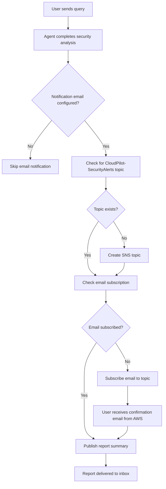

<div align="center">
  <em>Figure 17.1: AWS SNS Email Notification Flow</em>
</div>

**Figure 17.1 Explanation:**

The agent automatically manages SNS topic lifecycle, subscription, and publishing. All operations use real AWS SDK calls via `execute_aws_api`. If any step fails (typically due to missing permissions), the agent reports the failure and provides the exact IAM actions needed: `sns:ListTopics`, `sns:CreateTopic`, `sns:ListSubscriptionsByTopic`, `sns:Subscribe`, `sns:Publish`.

---

## 18. Report Management — S3 Archival, PDF Export & Reports History

The email notifications described in Section 17 include report summaries. This section covers the full report lifecycle: S3 archival, PDF export, and the Reports History interface.

### S3 Report Archival

Every agent response is automatically archived to S3 following a 5-step protocol embedded in the system prompt:

1. Get AWS account ID via `STS:GetCallerIdentity`
2. Check if `cloudpilot-reports-<account-id>` bucket exists via `S3:HeadBucket`
3. If not, create with encryption (AES-256) and full public access block
4. Upload report as Markdown via `S3:PutObject` to `reports/<date>/<report-id>.md`
5. Confirm archival location at the end of the report

### PDF Export

The `ChatMessage` component includes a **Download PDF** button that uses `html2pdf.js` to convert the rendered Markdown (already displayed in the UI as styled HTML) into a downloadable PDF file.

### Reports History (`/reports`)

The Reports History page (`src/pages/ReportsHistory.tsx`) provides:
- Searchable list of all past conversations with assistant messages
- Severity badges extracted from message content
- Date filtering
- Click-through to full report view at `/report/:id`

### Report View (`/report/:id`)

The Report View page (`src/pages/Report.tsx`) displays a single historical conversation with:
- Full Markdown rendering with `react-markdown` and `remark-gfm`
- PDF download button
- Read-only presentation mode

---

## 19. UX Enhancements — Thinking Indicator & Permission Error Clarity

The report management features from Section 18 complete the user-facing output pipeline. This section covers two additional UX enhancements that improve the operational experience.

### Thinking Indicator

While the agentic loop (up to 15 iterations) is processing, the `ThinkingIndicator` component displays an animated "Agent is thinking..." panel with:
- Three bouncing dots with staggered animation delays
- The CloudPilot logo
- Text: "Agent is thinking..."

This provides visual feedback during what can be a multi-second processing window (especially for broad audits that require many sequential API calls).

### Permission Error Clarity

When an AWS API call fails with a permission error (`AccessDeniedException`, `AccessDenied`, `UnauthorizedAccess`, `AuthorizationError`, or HTTP 403), the edge function constructs a detailed error message including:
- The exact service and operation that failed
- A ready-to-use IAM policy snippet
- The original AWS error for debugging

This error is fed back to the AI, which incorporates the guidance into its response.

---

## 20. Compliance Frameworks

The security analysis capabilities described throughout Sections 8–19 map directly to industry compliance frameworks. CloudPilot AI supports real-time assessment against these frameworks by querying actual account configurations:

| Framework | Coverage |
|-----------|----------|
| **CIS AWS Foundations Benchmark v3.0** | IAM, logging, monitoring, networking controls |
| **NIST 800-53 Rev. 5** | Access control, audit, system integrity, risk assessment |
| **SOC 2 Type II** | Security, availability, confidentiality controls |
| **PCI-DSS v4.0** | Network security, access control, monitoring, encryption |
| **HIPAA** | PHI protection, access controls, audit trails |
| **ISO 27001:2022** | Information security management system controls |
| **FedRAMP** | Federal cloud security requirements |
| **AWS Well-Architected Security Pillar** | Identity, detection, infrastructure, data, incident response |
| **MITRE ATT&CK Cloud** | Tactics, techniques, procedures for cloud attacks |
| **GDPR** | Data protection, privacy, consent management |
| **CCPA** | Consumer privacy, data access rights |
| **CMMC 2.0** | Cybersecurity maturity model certification |
| **NIST CSF v2.0** | Cybersecurity framework identify, protect, detect, respond, recover |
| **NIS2** | EU network and information security directive |
| **DORA** | Digital operational resilience act |
| **HITRUST CSF** | Health information trust alliance framework |
| **IRAP** | Information security registered assessors program |

The mandatory report format (Section 15) includes a **Compliance Mapping Matrix** that maps each finding to all applicable frameworks.

---

## 21. VPC Endpoint Configuration Guide — Fully Private AWS API Routing

For environments with strict network isolation requirements (FedRAMP, HIPAA, PCI-DSS), CloudPilot AI supports fully private AWS API routing via VPC Endpoints. This section provides the complete configuration guide.

### How It Works

The AWS SDK v3 used by `aws-executor` resolves service endpoints via DNS. When a VPC Interface Endpoint is created with **Private DNS enabled**, DNS records within the VPC resolve to private IP addresses, routing all traffic over the AWS internal backbone with zero code changes.

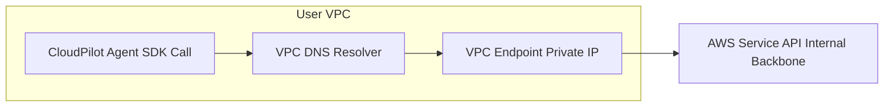

<div align="center">
  <em>Figure 21.1: Private DNS Resolution Flow — SDK Calls Route to VPC Endpoint Private IPs</em>
</div>

**Figure 21.1 Explanation:**

SDK calls resolve service hostnames (e.g., `s3.us-east-1.amazonaws.com`) to VPC endpoint private IPs instead of public IPs, routing all traffic over the AWS internal network.

### Required VPC Endpoints (20 Services)

| AWS Service | VPC Endpoint Service Name | Type | Private DNS | Priority |
|-------------|---------------------------|------|-------------|----------|
| STS | `com.amazonaws.<region>.sts` | Interface | Yes | Critical |
| S3 | `com.amazonaws.<region>.s3` | Gateway + Interface | Yes (Interface) | Critical |
| IAM | `com.amazonaws.<region>.iam` | Interface | Yes | Critical |
| EC2 | `com.amazonaws.<region>.ec2` | Interface | Yes | High |
| Lambda | `com.amazonaws.<region>.lambda` | Interface | Yes | High |
| RDS | `com.amazonaws.<region>.rds` | Interface | Yes | High |
| CloudTrail | `com.amazonaws.<region>.cloudtrail` | Interface | Yes | High |
| CloudWatch Logs | `com.amazonaws.<region>.logs` | Interface | Yes | High |
| CloudWatch | `com.amazonaws.<region>.monitoring` | Interface | Yes | High |
| GuardDuty | `com.amazonaws.<region>.guardduty` | Interface | Yes | High |
| Security Hub | `com.amazonaws.<region>.securityhub` | Interface | Yes | High |
| Config | `com.amazonaws.<region>.config` | Interface | Yes | Medium |
| KMS | `com.amazonaws.<region>.kms` | Interface | Yes | Medium |
| Secrets Manager | `com.amazonaws.<region>.secretsmanager` | Interface | Yes | Medium |
| SNS | `com.amazonaws.<region>.sns` | Interface | Yes | Medium |
| SQS | `com.amazonaws.<region>.sqs` | Interface | Yes | Low |
| ECR | `com.amazonaws.<region>.ecr.api` | Interface | Yes | Low |
| EKS | `com.amazonaws.<region>.eks` | Interface | Yes | Low |
| DynamoDB | `com.amazonaws.<region>.dynamodb` | Gateway | N/A | Low |
| Organizations | `com.amazonaws.<region>.organizations` | Interface | Yes | Low |

### Cost Considerations

| Endpoint Type | Hourly Cost | Data Processing |
|---------------|-------------|-----------------|
| Interface Endpoint | ~$0.01/hr per AZ | $0.01/GB |
| Gateway Endpoint (S3, DynamoDB) | Free | Free |

---

## 22. CloudWatch Automation

Moving from network-level security (Section 21) to monitoring automation, CloudPilot AI integrates with AWS CloudWatch to provide automated alerting, anomaly detection, and investigation capabilities.

### Capabilities

1. **Alarm Management:** Security alarms for unauthorized API calls, root usage, IAM changes, SG changes, NACL changes, console failures, S3 policy changes, CloudTrail changes, KMS key deletion
2. **Metric Filters:** Transform CloudTrail log events into actionable metrics
3. **Anomaly Detection:** ML-based detection of unusual API call volumes, resource creation, data transfer, cross-region activity
4. **Log Insights Queries:** SQL-like queries for deep investigation (denied calls, unusual logins, resource deletions)
5. **Dashboard Generation:** Widget layouts for security metrics, alarm status, API call trends

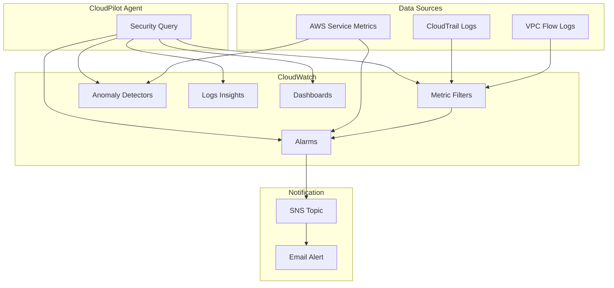

<div align="center">
  <em>Figure 22.1: CloudWatch Automation Architecture — Metric Filters, Alarms, Anomaly Detection, and SNS Alerting</em>
</div>

**Figure 22.1 Explanation:**

The agent creates metric filters from log sources (CloudTrail, VPC Flow Logs), configures alarms with anomaly detection on service metrics, and routes alerts through SNS to the user's email. Dashboard configurations provide at-a-glance security posture visualization.

### Required IAM Permissions

CloudWatch automation requires: `cloudwatch:PutMetricAlarm`, `cloudwatch:DescribeAlarms`, `cloudwatch:DeleteAlarms`, `cloudwatch:PutAnomalyDetector`, `cloudwatch:GetMetricData`, `cloudwatch:GetMetricStatistics`, `cloudwatch:ListMetrics`, `cloudwatch:PutDashboard`, `logs:PutMetricFilter`, `logs:DescribeMetricFilters`, `logs:StartQuery`, `logs:GetQueryResults`, `logs:DescribeLogGroups`, `logs:FilterLogEvents`, `sns:CreateTopic`, `sns:Subscribe`, `sns:Publish`.

---

## 23. Unified Audit Engine

The monitoring capabilities in Section 22 complement the broader audit capabilities. This section describes the unified audit engine, which provides structured, deterministic audit workflows rather than relying on the AI to invent its own inspection order.

### Overview

For broad account-health queries ("Show me everything wrong with my AWS account", "Am I SOC 2 ready?"), the `run_unified_audit` tool in `aws-agent-scanner` classifies the request into an audit intent and executes a fixed scanner plan.

### Audit Pipeline

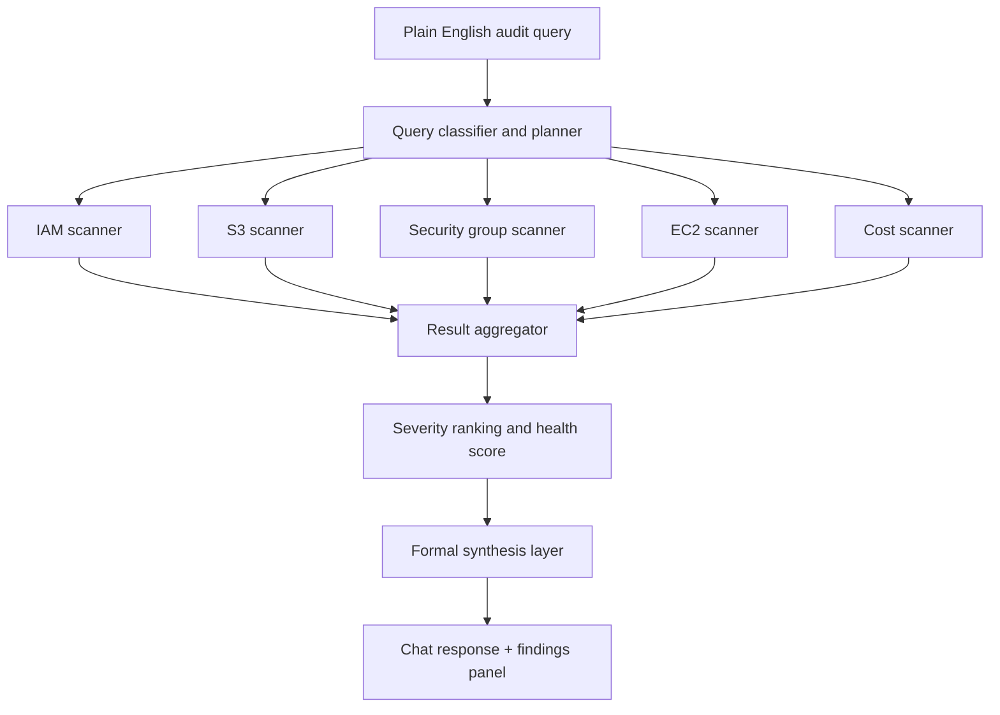

<div align="center">
  <em>Figure 23.1: Unified Audit Pipeline — From Natural Language Query to Ranked Findings</em>
</div>

**Figure 23.1 Explanation:**

The audit pipeline works in four stages: (1) The query classifier determines which scanners to run based on the natural language input. (2) Selected scanners execute real AWS API calls via `aws-executor` and return normalized findings. (3) The aggregator collects all findings and computes a health score. (4) The synthesis layer formats the results for the AI to present.

### Implemented Scanners

| Scanner | Checks |
|---------|--------|
| IAM | `AdministratorAccess` attached, MFA presence, stale access keys (90+ days) |
| S3 | Public Access Block disabled, default encryption missing, lifecycle rules absent |
| Security Groups | Internet-exposed ingress on sensitive ports (22, 3389, 3306, 5432, etc.) |
| EC2 / EBS | Public instances without IMDSv2, unattached EBS volumes |
| Cost | Elevated service spend, statistical spikes over 14-day baseline |

### Cached Audit Results

Unified audit results are cached in the `unified_audit_cache` table with per-account, per-audit-type keys. The cache stores the planner (which scanners ran), the full response, a `last_refreshed_at` timestamp, and an `expires_at` timestamp. The frontend receives freshness metadata.

### Health Score

The audit layer computes an **Account Health Score** out of 100:

| Severity | Score Impact |
|----------|-------------|
| CRITICAL | -20 |
| HIGH | -10 |
| MEDIUM | -5 |
| LOW | -2 |

---

## 24. IAM Automation — Preview, Confirm, Execute

Building on the audit findings from Section 23, users often need to remediate IAM issues. This section describes the guarded IAM automation flow.

### Supported Flow

The `manage_iam_access` tool supports a narrow but high-value use case: granting least-privilege read-only S3 access to a user, group, or role through a managed policy.

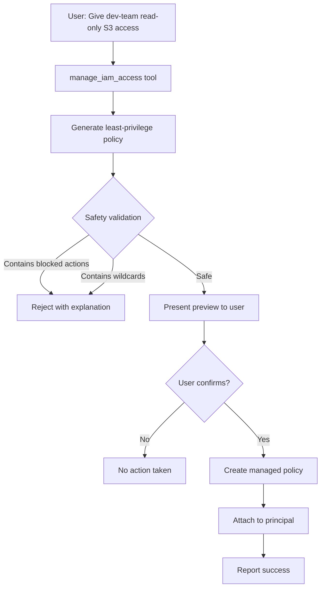

<div align="center">
  <em>Figure 24.1: IAM Automation Flow — Preview, Validate, Confirm, Execute</em>
</div>

**Figure 24.1 Explanation:**

The flow prevents arbitrary IAM mutations: blocked actions (`iam:*`, `iam:PassRole`, `sts:AssumeRole`) are hardcoded; wildcard service actions are rejected; the generated policy is constrained to supported service/scope templates; execution only occurs after explicit user confirmation.

### Safety Guarantees

| Guarantee | Implementation |
|-----------|---------------|
| No arbitrary IAM JSON | Constrained to service/scope templates |
| Blocked actions | `IAM_BLOCKED_ACTIONS` set in `aws-agent` |
| Wildcard rejection | Wildcard service actions rejected |
| Human-in-the-loop | Requires explicit confirmation message |

### Current Scope

| Operation | Support |
|-----------|---------|
| Attach least-privilege policy | Yes |
| S3 read-only template | Yes |
| Arbitrary IAM mutations | No |
| Inline policy creation | No |
| Role trust policy editing | No |

---

## 25. Security Group Automation — Risk-Gated Mutations

Complementing IAM automation (Section 24), security group automation provides the same preview-confirm-execute pattern for network rules.

### Supported Operations

The `manage_security_group_rule` tool supports: allow/revoke ingress, allow/revoke egress, CIDR-based rules, and security-group-to-security-group rules.

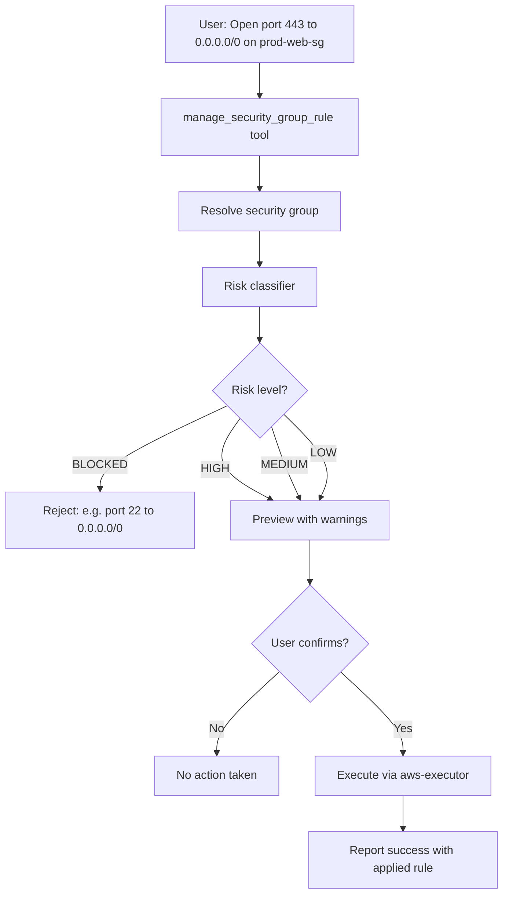

<div align="center">
  <em>Figure 25.1: Security Group Automation — Risk Classification and Guarded Execution</em>
</div>

**Figure 25.1 Explanation:**

The validator classifies each request as `LOW`, `MEDIUM`, `HIGH`, or `BLOCKED`. Hard-blocked examples: port 22 to `0.0.0.0/0`, port 3389 to `0.0.0.0/0`. Risk classification considers: public internet exposure, sensitive ports, all-traffic rules, production-like naming/tagging, egress internet access.

### Preview Payload

Before execution, the user sees: target group, direction, exact requested permission, existing matching rule (if any), whether the operation is a no-op, risk level and reasons, and confirmation instruction.

---

## 26. Cost Automation — Rules, Anomalies, and Remediation

Beyond security posture (Sections 23–25), CloudPilot AI includes cost automation. This section describes cost rule management, anomaly detection, and remediation.

### Current Capabilities

| Capability | Description |
|-----------|-------------|
| Cost rule creation | Parse and store budget/spike rules from natural language via `manage_cost_rule` |
| Cost anomaly scan | Pull 14-day spend data, detect spikes and trends via `run_cost_anomaly_scan` |
| Idle resource analysis | Identify low-utilization non-production EC2 instances (< 2% avg CPU over 24h) |
| Remediation classification | Distinguish alert-only vs confirm-required vs auto-fix candidates |

### Anomaly Detection

Implemented in `guardian-scheduler` (598 lines), the detector supports:

- **Statistical spike detection:** Z-score > 2.5 against 14-day baseline per service
- **Threshold breach detection:** Total daily spend against user-defined threshold rules
- **Idle EC2 analysis:** CloudWatch `CPUUtilization` metrics, non-production instances only (excludes `env=prod` tags), cost estimation via instance type lookup table

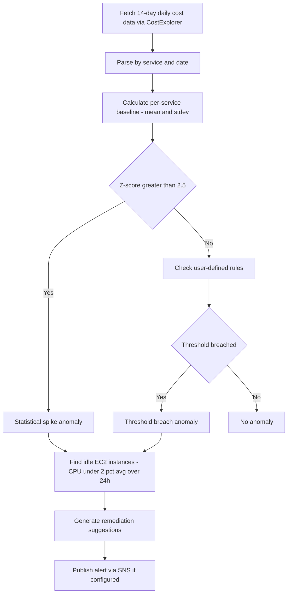

<div align="center">
  <em>Figure 26.1: Cost Anomaly Detection Pipeline — Statistical Analysis and Idle Resource Identification</em>
</div>

**Figure 26.1 Explanation:**

The pipeline fetches 14 days of daily cost data from AWS Cost Explorer, computes per-service statistical baselines, applies Z-score anomaly detection, checks user-defined threshold rules, identifies idle EC2 instances via CloudWatch metrics (excluding production-tagged instances), and generates remediation suggestions.

### Scheduled Polling

Cost anomalies are proactively evaluated through the `guardian-scheduler` edge function, triggered by EventBridge on a schedule. When anomalies are detected, alerts are dispatched via SNS.

---

## 27. Drift Detection — Baselines, Diffs, and Morning Digests

Cost anomalies (Section 26) detect spending changes; drift detection tracks configuration changes. This section describes the baseline-driven drift engine.

### Core Model

The system captures **resource snapshots** for supported resources and computes stable SHA-256 fingerprints. Drift is detected by comparing current snapshots against a previously captured baseline.

### Supported Resource Types

- Security groups (ingress/egress rules, tags, VPC)
- IAM users (attached policies, MFA status, access keys)
- S3 buckets (public access block, encryption, versioning)

### Drift Lifecycle

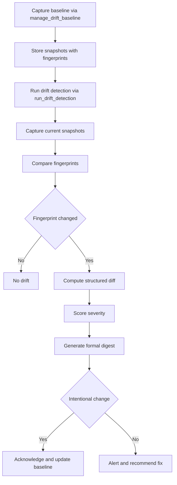

<div align="center">
  <em>Figure 27.1: Drift Detection Lifecycle — Baseline, Compare, Score, Alert, and Acknowledge</em>
</div>

**Figure 27.1 Explanation:**

The drift lifecycle begins with baseline capture: `manage_drift_baseline` snapshots all supported resources and computes SHA-256 fingerprints of their normalized state. When `run_drift_detection` runs (manually or via `guardian-scheduler`), it captures fresh snapshots, compares fingerprints, and for any changes: computes a structured diff (field-by-field before/after), scores severity using rule-based logic, and generates a formal digest with fix prompts.

### Drift Risk Rules

| Rule | Severity | Fix Prompt |
|------|----------|-----------|
| World-open inbound SG rule added | CRITICAL | `remove world-open rule from {id}` |
| S3 public access block removed | CRITICAL | `block all public access on {id}` |
| `AdministratorAccess` attached to IAM user | HIGH | `review admin access for {id}` |
| MFA disabled on IAM user | HIGH | `re-enable MFA for {id}` |
| S3 versioning disabled | MEDIUM | `re-enable versioning on {id}` |

---

## 28. Guardian Automation — Scheduler, Event Processor, and Autonomous Scanning

Drift detection (Section 27) operates on-demand or on a schedule. This section describes the two Guardian edge functions that enable proactive, automated security operations, the stored credential system that powers autonomous scanning, and the auto-fix guardrail that governs remediation decisions.

### Stored AWS Credentials and Encryption Scheme

To enable fully autonomous scanning without manual credential injection, CloudPilot AI provides a credential storage system backed by the `stored_aws_credentials` table.

#### Table Schema

| Column | Type | Purpose |
|--------|------|---------|
| `user_id` | uuid | Owner of the credential set |
| `label` | text | Human-readable label (default: "Default") |
| `region` | text | AWS region (default: us-east-1) |
| `encrypted_access_key_id` | text | XOR-encrypted AWS access key ID |
| `encrypted_secret_access_key` | text | XOR-encrypted AWS secret access key |
| `encrypted_session_token` | text | XOR-encrypted session token (optional) |
| `credential_method` | text | `access_key` or `assume_role` |
| `role_arn` | text | IAM role ARN for assume-role method |
| `account_id` | text | AWS account ID (resolved during exchange) |
| `guardian_enabled` | boolean | Whether autonomous scanning is active |
| `scan_mode` | text | `cost`, `drift`, or `all` |
| `notification_email` | text | Email for SNS alert dispatch |
| `last_scan_at` | timestamptz | Timestamp of most recent scan |
| `last_scan_status` | text | Result of the last scan (success or error detail) |

#### Credential Encryption

Credentials are encrypted server-side using **AES-256-GCM** via the `aws-credential-vault` edge function (see Section 32 for full details):

1. **Server-side encryption** (`aws-credential-vault`): The `AwsCredentialsPanel` sends raw credentials over TLS to the vault edge function, which derives a per-user AES-256 key using PBKDF2 (100,000 iterations) from the `SERVICE_ROLE_KEY` and a user-specific salt (`cloudpilot-vault-{user_id}`). Each credential field is encrypted with a random 12-byte IV and stored as `base64(IV || ciphertext)`.

2. **Server-side decryption** (`guardian-scheduler/index.ts`): Uses the identical PBKDF2 derivation to reconstruct the AES-256 key and decrypt each credential field during autonomous scans.

3. **Integrity verification**: AES-256-GCM provides authenticated encryption — any tampering with the ciphertext is detected via the 16-byte authentication tag.

4. **RLS protection**: The `stored_aws_credentials` table enforces row-level security so users can only access their own credentials. The `service_role` has full access for the autonomous scanner.

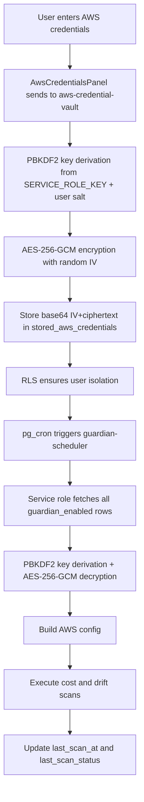

<div align="center">
  <em>Figure 28.1: Stored Credential Lifecycle — AES-256-GCM Encryption, Storage, and Autonomous Decryption</em>
</div>

**Figure 28.1 Explanation:**

The credential lifecycle spans two environments. On the client side, the `AwsCredentialsPanel` sends raw AWS keys over TLS to the `aws-credential-vault` edge function, which authenticates the caller via JWT, derives a per-user AES-256 key using PBKDF2, and encrypts each credential field with AES-256-GCM before storing them in the database. On the server side, the `guardian-scheduler` edge function—running with `service_role` privileges—fetches all rows where `guardian_enabled = true`, derives the same AES-256 key via PBKDF2, decrypts each credential, builds valid AWS SDK configurations, and executes the configured scan mode (cost, drift, or both). After each scan, it updates `last_scan_at` and `last_scan_status` to reflect the outcome.

#### UI Integration

The `AwsCredentialsPanel` component provides a toggle labeled **"Enable Guardian Scheduling"**. When activated:
- The credential set is encrypted and stored in `stored_aws_credentials` via upsert (keyed on `user_id` + `label`).
- An optional notification email can be configured for SNS alerts.
- The `scan_mode` defaults to `all` (both cost and drift).

### Guardian Scheduler (`guardian-scheduler`, 821 lines)

The scheduler operates in two modes: **manual** (single-user, credentials in request body) and **autonomous** (multi-user, credentials from database).

#### Manual Mode

Triggered by authenticated users or the automation webhook with explicit credentials:

1. **Authentication:** Validates Bearer token or `x-guardian-secret` header.
2. **Cost anomaly scanning:** Full 14-day cost data fetch, z-score anomaly detection (threshold: 2.5 sigma), idle EC2 identification (CPU < 2% over 24h).
3. **Drift detection:** Captures live snapshots of security groups, IAM users, and S3 buckets. Compares against stored baselines via SHA-256 fingerprints.
4. **Alert dispatch:** Publishes alerts via SNS to the user's configured email.
5. **Audit logging:** Records the scan in `agent_audit_log` and `automation_runs`.

#### Autonomous Mode

Triggered by `pg_cron` with no credentials in the request body. The scheduler detects this condition and enters autonomous mode:

1. **Detection:** If `body.credentials` is absent and either `x-guardian-secret` matches or `body.autonomous === true`, the function enters autonomous mode.
2. **Credential fetch:** Queries `stored_aws_credentials` for all rows where `guardian_enabled = true`.
3. **Per-user scanning:** Iterates over each stored credential set, decrypts it, builds an AWS config, and executes the configured `scan_mode`.
4. **Error isolation:** Each user's scan is wrapped in a try/catch so a single failure does not abort the entire batch.
5. **Status tracking:** Updates `last_scan_at` and `last_scan_status` for each credential row after scanning.

```mermaid
flowchart TD
    A[pg_cron hourly trigger] --> B[pg_net HTTP POST to guardian-scheduler]
    B --> C{Credentials in body?}
    C -- Yes --> D[Manual mode: single user scan]
    C -- No --> E[Autonomous mode]
    E --> F[Fetch all guardian_enabled credentials]
    F --> G[Decrypt each credential set]
    G --> H[For each user: run configured scans]
    H --> I{Scan mode}
    I -- cost --> J[Cost anomaly detection]
    I -- drift --> K[Drift baseline comparison]
    I -- all --> L[Both cost and drift]
    J --> M[Update last_scan_status]
    K --> M
    L --> M
    M --> N[Record in automation_runs and audit_log]
```

<div align="center">
  <em>Figure 28.2: Guardian Scheduler — Dual-Mode Architecture with Autonomous Credential Resolution</em>
</div>

**Figure 28.2 Explanation:**

The scheduler's dual-mode design allows both interactive and fully automated operation. In autonomous mode, triggered hourly by `pg_cron`, the function iterates over all stored credential sets, performing cost and drift scans independently for each user. This eliminates the need for users to be online or to manually trigger scans. Each scan result is persisted to `last_scan_status` (success or failure detail) and recorded across both the `agent_audit_log` and `automation_runs` tables for full traceability.

### Guardian Event Processor (`guardian-event-processor`, 581 lines)

The event processor receives real-time CloudTrail events forwarded via EventBridge + Lambda:

```mermaid
flowchart TD
    A[CloudTrail Event] --> B[EventBridge Rule]
    B --> C[Lambda Forwarder]
    C --> D[guardian-event-processor]
    D --> E[Enrich event]
    E --> F[Score risk]
    F --> G{Actor is Guardian}
    G -- Yes --> H[Skip to prevent loops]
    G -- No --> I[Match against policies]
    I --> J{Matching policies}
    J -- No --> K[No action]
    J -- Yes --> L{Response type}
    L -- auto_fix --> M3[Check auto-fix guardrail]
    L -- notify --> N[Publish SNS alert]
    L -- runbook --> O[Create runbook execution]
    L -- all --> P[All three actions]
    M3 --> Q{Guardrail pass}
    Q -- Yes --> R[Execute auto-fix]
    Q -- No --> S[Suppress and log reason]
    R --> T[Record in guardian_event_activity]
    S --> T
    N --> T
    O --> T
```

<div align="center">
  <em>Figure 28.3: Guardian Event Processor — Real-Time CloudTrail Event Reaction Pipeline with Auto-Fix Guardrail</em>
</div>

**Figure 28.3 Explanation:**

The event processor implements a complete reactive security pipeline:

1. **Event Enrichment:** Extracts actor ARN, actor type (root, iam_user, assumed_role, service), resource ID/type, source IP, requested ports, source CIDRs. Detects Guardian-originated events to prevent feedback loops.

2. **Risk Scoring:** Rule-based scoring with CRITICAL for root usage, world-open SG rules, S3 public access block removal, CloudTrail disable, MFA deactivation. HIGH for `AdministratorAccess` attachment and IAM user creation.

3. **Policy Matching:** Matches against built-in policies and user-defined policies from the `event_response_policies` table. Built-in policies: auto-block public S3 access, flag root usage.

4. **Auto-Fix Guardrail:** Before executing any automatic remediation, the `canAutoFixEvent` function enforces two conditions:
   - The event must be **CRITICAL** severity. Non-critical events are suppressed.
   - The event must be in the **reversible critical allowlist** (`AUTO_FIXABLE_CRITICAL_EVENTS`), which includes only: `DeleteBucketPublicAccessBlock`, `DeleteBucketEncryption`, `DeleteTrail`, `StopLogging`, `AuthorizeSecurityGroupIngress`.
   
   If either condition fails, the auto-fix is suppressed and a structured reason is recorded alongside the event activity.

5. **Auto-Fix Actions:** Implemented fixes include:
   - `DeleteBucketPublicAccessBlock` -> `PutPublicAccessBlock` (restore all four blocks)
   - `DeleteBucketEncryption` -> `PutBucketEncryption` (restore AES-256)
   - `StopLogging`/`DeleteTrail` -> `StartLogging` (restart CloudTrail)
   - `AuthorizeSecurityGroupIngress` (world-open) -> `RevokeSecurityGroupIngress` (revoke the rule)

6. **Activity Recording:** Every processed event is recorded in the `guardian_event_activity` table with full context: matched policies, auto-fix results (including suppression reasons), notification outcomes, and runbook triggers. This powers the live event feed in the Operations Control Plane.

### Scheduling via pg_cron

The guardian-scheduler is invoked automatically via PostgreSQL's `pg_cron` extension, which runs inside the database itself. This eliminates the need for external schedulers like AWS EventBridge or Lambda.

```mermaid
flowchart TD
    A[pg_cron Extension - Hourly Schedule] --> B[pg_net HTTP POST]
    B --> C[guardian-scheduler Edge Function]
    C --> D{x-guardian-secret validation}
    D -- Valid --> E[Autonomous mode: all stored credentials]
    D -- Invalid --> F[400 Unauthorized]
    E --> G[Cost and drift scans per user]
    G --> H[SNS alerts for anomalies]
    G --> I[Update scan status in DB]
```

<div align="center">
  <em>Figure 28.4: pg_cron Scheduling — Autonomous Multi-User Scan Trigger</em>
</div>

**Figure 28.4 Explanation:**

The scheduling is implemented entirely within PostgreSQL using two extensions:

1. **`pg_cron`** — A PostgreSQL extension that provides cron-style job scheduling. The job `guardian-scheduler-hourly` runs at the top of every hour (`0 * * * *`).

2. **`pg_net`** — A PostgreSQL extension that enables HTTP requests from within the database. The cron job uses `net.http_post()` to invoke the guardian-scheduler edge function endpoint with the appropriate authentication header.

3. **Authentication:** The `x-guardian-secret` header carries the `GUARDIAN_AUTOMATION_WEBHOOK_SECRET` value, which the edge function validates before processing.

This approach is simpler and more reliable than external scheduling because:
- No AWS EventBridge rules or Lambda functions needed
- The scheduler runs as close to the data as possible
- No external service dependencies for scheduling
- The cron job persists across deployments

### Authentication

Both Guardian functions use dual authentication:
- **Bearer token:** Standard Supabase auth for manual/UI invocation
- **Webhook secret:** `GUARDIAN_AUTOMATION_WEBHOOK_SECRET` via `x-guardian-secret` header for automated pg_cron invocation

---

## 29. AWS Organizations Automation

The per-account automation in Sections 24–28 extends to multi-account operations through AWS Organizations support.

### Cross-Account Execution Model

The implementation assumes a central **GuardianExecutionRole** pattern where the management account can assume into member accounts using STS with an external ID.

### Implemented Org Queries (`run_org_query`)

| Query Type | Description |
|------------|-------------|
| `accounts_without_mfa` | Accounts where IAM users lack MFA |
| `accounts_with_public_s3` | Accounts with public S3 buckets |
| `list_org_scps` | All attached SCPs |
| `untagged_env_accounts` | Accounts missing `env` tag |
| `org_structure` | Full organizational structure |
| `guardian_onboarding_status` | Accounts where GuardianExecutionRole cannot be assumed |

### Guarded SCP Rollout (`manage_org_operation`)

The org-wide mutation path supports SCP rollout through a fixed template library:

| SCP Template | Purpose |
|-------------|---------|
| `deny_non_approved_regions` | Restrict to specified regions |
| `deny_root_account_usage` | Block root account API calls |
| `require_mfa_for_all_actions` | Enforce MFA universally |
| `deny_leaving_org` | Prevent `LeaveOrganization` |
| `enforce_s3_encryption` | Require S3 encryption |

### Blast Radius Controls

Org-wide changes are evaluated against environment tiers (`dev`, `staging`, `prod`, `unknown`) that determine: maximum account count, auto-execution eligibility, rollback planning requirements, and double confirmation requirements. For larger or higher-risk scopes, explicit confirmation phrases (e.g., `apply to 12 accounts`) are required.

---

## 30. Runbook Execution Engine

The individual automation capabilities from Sections 24–29 compose into multi-step workflows through the runbook execution engine.

### Why This Matters

Earlier flows focused on single operations. Runbooks elevate CloudPilot AI into an autonomous workflow system capable of planning and executing multi-step responses with durable execution state.

### Implemented Runbook Library

| Runbook | Status |
|---------|--------|
| Public S3 lockdown | Implemented |
| Cost spike remediation | Implemented |
| Data breach response | Implemented (partially guided) |

### Execution Modes

| Mode | Behavior |
|------|----------|
| **Plan only** | Produce formal preview with resolved steps |
| **Dry run** | Execute query steps, skip AWS action steps |
| **Execution** | Run automatic steps, pause on confirmation steps |
| **Resume** | Continue planned/paused runbook via `run playbook` or `confirm` |
| **Abort** | Terminate active runbook |

### Execution Pattern

```mermaid
flowchart TD
    A[User: Run the public S3 lockdown playbook] --> B[Resolve runbook from natural language]
    B --> C[Gather context and fill placeholders]
    C --> D[Persist planned execution to DB]
    D --> E[Show formal step preview]
    E --> F{User: run playbook}
    F --> G[Execute automatic steps]
    G --> H{Confirmation step?}
    H -- Yes --> I[Pause and prompt user]
    I --> J{User: confirm}
    J --> K[Execute confirmation step]
    K --> G
    H -- No --> L[Continue to next step]
    L --> G
    G --> M[All steps complete]
    M --> N[Produce formal completion report]
```

<div align="center">
  <em>Figure 30.1: Runbook Execution Lifecycle — From Natural Language Request to Formal Completion Report</em>
</div>

**Figure 30.1 Explanation:**

The runbook engine: (1) resolves the runbook from natural language, (2) gathers context and fills placeholders, (3) persists the planned execution, (4) shows a formal preview, (5) executes on `run playbook`, (6) pauses at confirmation checkpoints, (7) persists per-step results, (8) produces a formal completion report.

---

## 31. Operations Control Plane

All automation features from Sections 22–30 converge in the Operations Control Plane, accessible at `/operations`.

### Key Components

```mermaid
graph TB
    subgraph AWS Environment
        A[CloudTrail Events] --> B[EventBridge Rule]
        B --> C[Lambda Forwarder]
        D[pg_cron Hourly] --> E[guardian-scheduler]
    end

    subgraph CloudPilot Backend
        C --> F[guardian-event-processor]
        E --> G[Cost and Drift Evaluator]
        F --> H[(Supabase DB)]
        G --> H
    end

    subgraph Operations Control Plane
        H -.-> I[Live Dashboard Updates via Realtime]
        I --> J[Event Policies View]
        I --> K[Cost Rules View]
        I --> L[Drift and Baselines View]
        I --> M4[Runbook History with Step Streaming]
        I --> N[Organization Rollouts View]
        I --> O[Guardian Autonomous Status]
        I --> P2[Live Event Feed with Auto-Fix Status]
        I --> Q2[Automation Runtime History]
    end
```

<div align="center">
  <em>Figure 31.1: Operations Control Plane — Real-Time Reactive Architecture with Live UI Updates</em>
</div>

**Figure 31.1 Explanation:**

The Operations page (`src/pages/Operations.tsx`, 839 lines) aggregates data from all automation tables into eight interactive views:

1. **Guardian Autonomous Status:** Displays all credential sets enrolled in Guardian scanning (`stored_aws_credentials` where `guardian_enabled = true`). Each card shows the label, account ID, last scan timestamp, anomaly count parsed from `last_scan_status`, and an ACTIVE/PENDING badge. The status parser handles both JSON format (`{"status":"Completed","anomalies":3}`) and plain string format with regex extraction.

2. **Live Event Feed with Auto-Fix Status:** Each processed CloudTrail event from `guardian_event_activity` shows the event name, resource, region, actor ARN, risk level badge, matched policies, and — critically — an explicit auto-fix status badge:
   - **AUTO-FIX APPLIED** (green): At least one automatic remediation action was executed. Shows the count of applied actions.
   - **AUTO-FIX SUPPRESSED** (red): Remediation was attempted but blocked by the guardrail. Shows the count of suppressed actions and indicates they were suppressed by policy guardrails.
   - **NO AUTO-FIX** (neutral): No automatic remediation was attempted for this event.
   
   This is implemented by the `summarizeAutoFixState` function, which inspects the `auto_fixes` array for each event. Each item has an `applied` boolean — `true` means the fix was executed, `false` or `skipped: true` means it was suppressed. The detail text provides a human-readable explanation of why.

3. **Automation Runtime History:** Records from the `automation_runs` table showing scheduler and processor execution history with source, mode, account, status, and summary JSON.

4. **Event Policies:** View and manage CloudTrail event response rules. Users define risk thresholds and response actions (notify, runbook, auto_fix) directly from the UI with inline toggle and edit controls.

5. **Cost Rules:** Active spend anomaly thresholds, their scopes, and required responses.

6. **Drift & Baselines:** Aggregated summary of baselined resources and unresolved drift events with severity badges.

7. **Runbook History (Live Streaming):** Active runbooks with expandable step-by-step progress. The UI subscribes to Supabase Realtime for live step progression updates.

8. **Organization Rollouts:** History of changes broadcasted across member accounts with blast radius details.

### Auto-Fix Status Transparency

The auto-fix status system is a key trust mechanism for Guardian automation. Rather than simply showing that an event was processed, the Operations page makes the Guardian's decision-making visible:

```mermaid
flowchart TD
    A[guardian_event_activity row] --> B{auto_fixes array present}
    B -- Empty or null --> C[NO AUTO-FIX badge]
    B -- Has items --> D[Inspect each item]
    D --> E{Any item with applied = true}
    E -- Yes --> F[AUTO-FIX APPLIED badge]
    E -- No --> G{Any item with skipped = true or applied = false}
    G -- Yes --> H[AUTO-FIX SUPPRESSED badge]
    F --> I[Show count of applied and suppressed actions]
    H --> J[Show count suppressed by policy guardrails]
    C --> K[Show No automatic remediation was attempted]
```

<div align="center">
  <em>Figure 31.2: Auto-Fix Status Resolution — From Event Activity Data to User-Visible Badge</em>
</div>

**Figure 31.2 Explanation:**

The `summarizeAutoFixState` function in Operations.tsx reads the `auto_fixes` JSON array from each `guardian_event_activity` row. It counts items where `applied === true` (successful fixes) and items where `skipped === true` or `applied === false` (suppressed fixes). If any were applied, the badge is green with the applied count. If all were suppressed, the badge is red with the suppressed count and an explanation that policy guardrails blocked execution. If no auto-fix items exist, a neutral badge indicates no remediation was attempted. This aligns with the `canAutoFixEvent` guardrail in the event processor (Section 28), which only allows auto-fix for reversible CRITICAL events.

---

## 32. AES-256-GCM Credential Vault

The `aws-credential-vault` edge function replaces the earlier client-side XOR cipher with a production-grade AES-256-GCM encryption scheme for stored AWS credentials. This is a critical security upgrade: XOR encryption is trivially reversible if the key is known, while AES-256-GCM provides authenticated encryption with integrity verification.

### Key Derivation

The encryption key is derived server-side using **PBKDF2** with 100,000 iterations:

- **Key Material:** The Supabase `SERVICE_ROLE_KEY` (never exposed to the client).
- **Salt:** A user-specific string `cloudpilot-vault-{user_id}`, ensuring each user's credentials are encrypted with a unique derived key.
- **Algorithm:** PBKDF2-SHA-256 producing a 256-bit AES key.

This means even if the encrypted ciphertext is exfiltrated from the database, it cannot be decrypted without both the service role key AND the user ID.

```mermaid
flowchart LR
    A[User enters AWS keys in browser] --> B[AwsCredentialsPanel calls aws-credential-vault]
    B --> C[Edge Function authenticates user via JWT]
    C --> D[PBKDF2 derives AES-256 key from SERVICE_ROLE_KEY + user_id salt]
    D --> E[AES-256-GCM encrypts each credential field with random 12-byte IV]
    E --> F[Base64 encoded IV+ciphertext stored in stored_aws_credentials table]
    F --> G[guardian-scheduler decrypts using same derivation for autonomous scans]
```

<div align="center">
  <em>Figure 32.1: AES-256-GCM Credential Encryption Flow</em>
</div>

**Figure 32.1 Explanation:**

Raw AWS credentials never persist on the client. When the user opts into Guardian scheduling, the `AwsCredentialsPanel` sends the raw keys to the `aws-credential-vault` edge function over TLS. The function authenticates the caller via their JWT, derives a user-specific AES-256 key using PBKDF2, encrypts each credential field (access key ID, secret access key, optional session token) with AES-256-GCM using a cryptographically random 12-byte IV, and stores the result as `base64(IV || ciphertext)` in the `stored_aws_credentials` table. The `guardian-scheduler` uses the identical PBKDF2 derivation to decrypt credentials during autonomous scans.

### Encryption Format

Each encrypted field is stored as a Base64 string containing:

| Bytes | Content |
|-------|---------|
| 0–11 | Random IV (12 bytes, unique per encryption) |
| 12–N | AES-256-GCM ciphertext (includes 16-byte auth tag) |

### Security Properties

| Property | Guarantee |
|----------|-----------|
| Confidentiality | AES-256-GCM with 256-bit key |
| Integrity | GCM authentication tag prevents tampering |
| Key Isolation | Per-user derived keys — compromising one user's key does not affect others |
| IV Uniqueness | Cryptographically random 12-byte IV per encryption operation |
| Key Stretching | 100,000 PBKDF2 iterations resist brute-force attacks |
| Server-Only | Raw keys never stored client-side; encryption/decryption happens exclusively in edge functions |

### `stored_aws_credentials` Table Schema

| Column | Type | Description |
|--------|------|-------------|
| `id` | UUID | Primary key |
| `user_id` | UUID | Owner (references `auth.users`) |
| `label` | TEXT | User-assigned label (default: "Default") |
| `region` | TEXT | AWS region (default: us-east-1) |
| `encrypted_access_key_id` | TEXT | AES-256-GCM encrypted, Base64-encoded |
| `encrypted_secret_access_key` | TEXT | AES-256-GCM encrypted, Base64-encoded |
| `encrypted_session_token` | TEXT | AES-256-GCM encrypted (nullable) |
| `credential_method` | TEXT | "access_key" or "assume_role" |
| `role_arn` | TEXT | IAM role ARN for assume_role method |
| `account_id` | TEXT | AWS account ID resolved during exchange |
| `notification_email` | TEXT | Email for SNS Guardian alerts |
| `guardian_enabled` | BOOLEAN | Whether autonomous scanning is active |
| `scan_mode` | TEXT | "all", "cost", or "drift" |
| `org_id` | UUID | Organization for multi-tenant isolation |
| `last_scan_at` | TIMESTAMPTZ | Timestamp of last Guardian scan |
| `last_scan_status` | TEXT | Result of last scan (success/failed) |

### RLS Policies

- **Authenticated users:** Can only CRUD their own credentials (`auth.uid() = user_id`).
- **Service role:** Full access for Guardian scheduler autonomous scans.
- **Unique constraint:** `(user_id, label)` prevents duplicate credential entries per user.

---

## 33. RBAC & Multi-Tenant Organization System

CloudPilot implements a full role-based access control (RBAC) system with multi-tenant isolation at the organization level. This is the foundation for enterprise team management.

### Role Hierarchy

```mermaid
flowchart TD
    A[owner] --> B[admin]
    B --> C[member]
    C --> D[viewer]
    A -- "Full control: billing, delete org, manage all members" --> A
    B -- "Manage members, credentials, policies" --> B
    C -- "Use agent, view reports, manage own credentials" --> C
    D -- "Read-only access to reports and dashboards" --> D
```

<div align="center">
  <em>Figure 33.1: RBAC Role Hierarchy</em>
</div>

**Figure 33.1 Explanation:**

The `app_role` enum defines four levels: `owner`, `admin`, `member`, and `viewer`. Each level inherits the permissions of levels below it. Owners have full control including billing and organization deletion. Admins can manage members and credentials. Members can use the agent and manage their own resources. Viewers have read-only access.

### Database Schema

**`organizations` table:**

| Column | Type | Description |
|--------|------|-------------|
| `id` | UUID | Primary key |
| `name` | TEXT | Organization display name |
| `slug` | TEXT | URL-safe identifier |
| `created_by` | UUID | User who created the org |
| `created_at` | TIMESTAMPTZ | Creation timestamp |

**`org_members` table:**

| Column | Type | Description |
|--------|------|-------------|
| `id` | UUID | Primary key |
| `org_id` | UUID | Foreign key to organizations |
| `user_id` | UUID | The member's auth user ID |
| `role` | `app_role` | owner, admin, member, or viewer |
| `invited_by` | UUID | Who invited this member |
| `joined_at` | TIMESTAMPTZ | When they joined |

**`user_roles` table:**

| Column | Type | Description |
|--------|------|-------------|
| `id` | UUID | Primary key |
| `user_id` | UUID | The user's auth ID |
| `role` | `app_role` | Global role assignment |

### Auto-Provisioning Trigger

A `handle_new_user_org` trigger on `auth.users` automatically:

1. Creates a personal organization named after the user's email prefix.
2. Adds the user as `owner` of that organization.
3. Assigns the `owner` role in the global `user_roles` table.

This ensures every new signup immediately has a working org context.

### Security Definer Functions

To prevent RLS infinite recursion, three `SECURITY DEFINER` functions are used:

| Function | Purpose |
|----------|---------|
| `has_role(_user_id, _role)` | Check if user has a specific global role |
| `is_org_member(_user_id, _org_id)` | Check if user belongs to an organization |
| `get_org_role(_user_id, _org_id)` | Get user's role within an organization |

### Multi-Tenant Data Isolation

The `stored_aws_credentials` table includes an `org_id` column. RLS policies on credential tables enforce that users can only access credentials belonging to organizations they are members of. This creates hard data boundaries between tenants.

---

## 34. Multi-Factor Authentication (MFA) Enrollment

CloudPilot supports TOTP-based multi-factor authentication through the `MfaSetup` component, which integrates with the authentication provider's native MFA capabilities.

### Enrollment Flow

```mermaid
sequenceDiagram
    participant U as User
    participant C as MfaSetup Component
    participant A as Auth API

    U->>C: Click Enable MFA
    C->>A: mfa.enroll(factorType: totp)
    A-->>C: Return QR code + TOTP secret + factor ID
    C->>U: Display QR code and manual secret
    U->>U: Scan QR with authenticator app
    U->>C: Enter 6-digit verification code
    C->>A: mfa.challenge(factorId)
    A-->>C: Return challenge ID
    C->>A: mfa.verify(factorId, challengeId, code)
    A-->>C: MFA enrolled successfully
    C->>U: Show success confirmation
```

<div align="center">
  <em>Figure 34.1: TOTP MFA Enrollment Sequence</em>
</div>

**Figure 34.1 Explanation:**

The enrollment follows a three-phase process: (1) **Enrollment** — the auth API generates a TOTP secret and returns a QR code image; (2) **Challenge** — after the user scans the QR code with their authenticator app, the API creates a challenge; (3) **Verification** — the user enters the 6-digit code from their app, which is verified against the challenge. On success, MFA is permanently enabled for the account.

### UI Components

The `MfaSetup` component in the sidebar provides:

- **Idle state:** A compact card with "Enable MFA" button.
- **Enrolling state:** Full QR code display with manual secret (copyable), plus a 6-digit verification input with `tracking-[0.3em]` monospace styling.
- **Complete state:** Green confirmation badge indicating MFA is active.

### Security Considerations

- The TOTP secret is only displayed once during enrollment and is never stored client-side.
- Compatible with Google Authenticator, Authy, 1Password, and any RFC 6238-compliant app.
- After enrollment, users must provide a TOTP code on every sign-in.

---

## 35. Edge Function Rate Limiting

All edge functions are protected by a server-side token-bucket rate limiter using the `rate_limit_entries` table. This prevents abuse, DoS attacks, and runaway automation loops.

### Implementation

The rate limiter operates as follows:

```mermaid
flowchart TD
    A[Incoming request to edge function] --> B[Compute rate limit key]
    B --> C[Query rate_limit_entries table for key within window]
    C --> D{Entry exists?}
    D -- No --> E[Insert new entry with count = 1]
    D -- Yes --> F{Count >= max?}
    F -- Yes --> G[Return 429 Too Many Requests with Retry-After header]
    F -- No --> H[Increment request_count]
    E --> I[Process request normally]
    H --> I
```

<div align="center">
  <em>Figure 35.1: Token-Bucket Rate Limiting Flow</em>
</div>

**Figure 35.1 Explanation:**

Each request computes a rate limit key (e.g., `guardian-scheduler:autonomous` or `guardian-scheduler:{userId}`). The function queries the `rate_limit_entries` table for an existing entry within the current time window. If the count exceeds the maximum allowed requests, a 429 response with a `Retry-After` header is returned. Otherwise, the count is incremented and the request proceeds.

### Configuration

| Parameter | Value | Description |
|-----------|-------|-------------|
| Window | 5 minutes | Sliding window duration |
| Max Requests | 10 | Maximum requests per window per key |
| Key Format | `{function}:{userId}` | Scoped per function and user |
| Response | 429 + `Retry-After` | Standard HTTP rate limit response |

### `rate_limit_entries` Table Schema

| Column | Type | Description |
|--------|------|-------------|
| `id` | UUID | Primary key |
| `key` | TEXT | Rate limit key (function + user scope) |
| `request_count` | INTEGER | Requests in current window |
| `window_start` | TIMESTAMPTZ | Start of current window |

RLS: Service role only — the rate limit table is not accessible to authenticated users.

---

## 36. Webhook Notification Integrations — Slack, PagerDuty & Generic

The `webhook-notify` edge function enables Guardian alerts, auto-fix notifications, drift events, and cost anomalies to be delivered to external channels in real time.

### Supported Channels

```mermaid
flowchart LR
    A[Guardian Event / Scan Result] --> B[webhook-notify Edge Function]
    B --> C{Channel Type}
    C -- Slack --> D[Rich Block Kit message with color-coded severity]
    C -- PagerDuty --> E[Events API v2 trigger with routing key]
    C -- Generic --> F[Standard JSON POST to any URL]
    D --> G[Slack Channel]
    E --> H[PagerDuty Service]
    F --> I[Custom Endpoint]
```

<div align="center">
  <em>Figure 36.1: Webhook Notification Dispatch Architecture</em>
</div>

**Figure 36.1 Explanation:**

When Guardian processes an event or completes a scan, it calls the `webhook-notify` function with a structured payload. The function looks up all active webhooks for the user, filters by subscribed event types, and dispatches to each channel using the appropriate format: Slack Block Kit attachments with severity-colored sidebars, PagerDuty Events API v2 with proper severity mapping, or a generic JSON POST.

### Slack Message Format

Slack webhooks produce rich Block Kit messages with:

- **Header:** CloudPilot alert title with shield emoji.
- **Fields:** Event type, severity, AWS account ID, region.
- **Body:** Summary text with findings details.
- **Footer:** Timestamp and CloudPilot AI branding.
- **Color:** Severity-mapped sidebar (`#dc2626` critical, `#ea580c` high, `#d97706` medium, `#2563eb` low).

### PagerDuty Integration

PagerDuty uses the Events API v2 (`https://events.pagerduty.com/v2/enqueue`) with:

- **Routing Key:** User-provided PagerDuty service integration key.
- **Severity Mapping:** critical → critical, high → error, medium → warning, low/info → info.
- **Custom Details:** Full event payload including region, account, and timestamp.

### `notification_webhooks` Table Schema

| Column | Type | Description |
|--------|------|-------------|
| `id` | UUID | Primary key |
| `user_id` | UUID | Owner |
| `channel_type` | TEXT | "slack", "pagerduty", or "generic" |
| `webhook_url` | TEXT | Destination URL or routing key |
| `label` | TEXT | User-assigned label |
| `subscribed_events` | JSONB | Array of event types to receive |
| `is_active` | BOOLEAN | Whether webhook is active |

### API Actions

| Action | Method | Description |
|--------|--------|-------------|
| `register` | POST | Add a new webhook with channel type and URL |
| `notify` | POST | Send notification to all active webhooks for user |
| `list` | POST | List all registered webhooks |
| `delete` | POST | Remove a webhook by ID |

### UI Component

The `WebhookSettings` component in the sidebar provides:

- Channel type selector (Slack / PagerDuty / Generic) with emoji indicators.
- URL/routing key input field.
- Label input for identification.
- List of configured webhooks with delete capability.
- Inline validation and error handling.

---

## 37. Guided Onboarding Wizard

New users are greeted with a 4-step guided onboarding wizard (`OnboardingWizard` component) that walks them through connecting AWS credentials, enabling Guardian, and running their first security audit.

### Wizard Steps

```mermaid
flowchart LR
    A[Step 1: Welcome] --> B[Step 2: Connect AWS]
    B --> C[Step 3: Enable Guardian]
    C --> D[Step 4: Ready]
    D --> E[Dismiss and start using CloudPilot]
```

<div align="center">
  <em>Figure 37.1: Onboarding Wizard Flow</em>
</div>

| Step | Title | Content |
|------|-------|---------|
| 1 | Welcome to CloudPilot AI | Overview of capabilities: real AWS API calls, STS token exchange, Guardian scheduling |
| 2 | Connect Your AWS Account | Instructions for the credentials panel, scoped-down IAM role guidance, AES-256-GCM storage note |
| 3 | Enable Guardian Automation | Guardian scheduling, notification email setup, Operations page overview |
| 4 | You're All Set! | First audit prompt suggestions, Reports page, webhook setup guidance |

### Persistence

The wizard's completion state is stored in `localStorage` as `cloudpilot-onboarding-complete`. Once dismissed (via "Skip" or completing all steps), it never appears again for that browser session. This avoids annoying returning users while ensuring first-time visitors receive proper guidance.

### Design

The wizard renders as a full-screen overlay (`fixed inset-0 z-50`) with a centered card. It uses Framer Motion for step transition animations (fade + slide), progress dots with animated width, and consistent design tokens from the CloudPilot design system.

---

## 38. End-to-End Test Suite

CloudPilot includes a Playwright-based E2E test suite covering authentication, routing, and UI interaction flows.

### Test Configuration

The Playwright configuration (`playwright.config.ts`) defines:

| Setting | Value |
|---------|-------|
| Test directory | `e2e/` |
| Browsers | Chromium (desktop) + iPhone 14 (mobile) |
| Base URL | `http://localhost:8080` |
| Retries | 2 in CI, 0 locally |
| Web server | Auto-starts `npm run dev` |
| Artifacts | Screenshots on failure, traces on first retry |

### Test Coverage

**Authentication Flow (`e2e/auth.spec.ts`):**

| Test | Assertion |
|------|-----------|
| Sign-in page rendering | H1 contains "CloudPilot AI", email/password inputs visible |
| Empty form validation | Error message "Email and password are required" displayed |
| Mode toggling | Switch between Sign In and Create Account tabs |
| Password visibility | Toggle password input between text and password types |
| Protected route redirect | Unauthenticated `/` redirects to `/auth` |
| Operations redirect | Unauthenticated `/operations` redirects to `/auth` |
| Reports redirect | Unauthenticated `/reports` redirects to `/auth` |
| 404 page | Unknown routes display "404" |

### Running Tests

```bash
# Install Playwright browsers (first time)
npx playwright install

# Run all tests
npx playwright test

# Run with UI mode
npx playwright test --ui

# Run specific test file
npx playwright test e2e/auth.spec.ts
```

---

## 39. Team Management UI

The RBAC schema from Section 33 is now exposed through a dedicated Team Management page (`/team`), enabling org owners and admins to view members, assign roles, invite new users, and understand credential access policies — all from a single interface.

### Page Architecture

```mermaid
flowchart TD
    A[User navigates to /team] --> B[Load org membership via org_members]
    B --> C[Determine user role]
    C --> D{Role check}
    D -- owner/admin --> E[Show full management controls]
    D -- member/viewer --> F[Show read-only member list]
    E --> G[Invite Member dialog]
    E --> H[Role Change dialog]
    E --> I[Remove Member action]
    F --> J[View members and credential access policy]
```

<div align="center">
  <em>Figure 39.1: Team Management Page — Role-Based UI Rendering</em>
</div>

**Figure 39.1 Explanation:**

When a user navigates to `/team`, the component loads their org membership from the `org_members` table, determines their role, and conditionally renders management controls. Owners and admins see invite, role-change, and removal buttons. Members and viewers see a read-only list of team members and the credential access policy.

### UI Sections

The Team page is organized into three sections:

1. **Role Summary Cards:** Four stat cards (Owner, Admin, Member, Viewer) showing the count of members in each role with descriptions of each role's permissions. This provides immediate visibility into the team's access distribution.

2. **Organization Members List:** A detailed list of all members with:
   - User identification (with "YOU" badge for the current user)
   - Role badge with color coding (amber for owner, primary for admin, neutral for member/viewer)
   - Join date and truncated user ID
   - **Role Change** button (visible to owners/admins, not for self or other owners)
   - **Remove** button (visible to owners only, not for self)

3. **Credential Access Policy:** A reference panel documenting the org-level credential access model:
   - **Owner/Admin**: Store and manage org-level AWS credentials, enable/disable Guardian, view all audit logs, invite/remove members
   - **Member/Viewer**: Use org-level credentials for queries, view reports, manage personal credentials (members only), read-only dashboard access (viewers only)

### Invite Flow

```mermaid
sequenceDiagram
    participant O as Owner/Admin
    participant UI as Team Page
    participant DB as Database

    O->>UI: Click Invite Member
    UI->>O: Show invite dialog (email + role selector)
    O->>UI: Enter email and select role
    UI->>DB: Create pending invitation
    DB-->>UI: Confirmation
    UI->>O: Toast notification - invite sent
```

<div align="center">
  <em>Figure 39.2: Member Invitation Sequence</em>
</div>

**Figure 39.2 Explanation:**

The invite flow is initiated by owners or admins through the Invite Member button. The dialog collects the invitee's email address and desired role (admin, member, or viewer — owner cannot be assigned via invite). The role selector provides inline descriptions so the inviter understands the access implications of each role.

### Role Management

Role changes are performed through an inline dialog that:

1. Shows the current member's truncated user ID for confirmation.
2. Provides a role selector limited to admin, member, and viewer (owner role cannot be assigned through the UI to prevent privilege escalation).
3. Displays the selected role's permission description for clarity.
4. Executes an `UPDATE` on `org_members` via Supabase, protected by RLS policies that ensure only owners and admins can modify roles (see Section 33).

### Access Control Matrix

| Action | Owner | Admin | Member | Viewer |
|--------|-------|-------|--------|--------|
| View team members | Yes | Yes | Yes | Yes |
| Invite new members | Yes | Yes | No | No |
| Change member roles | Yes | Yes | No | No |
| Remove members | Yes | No | No | No |
| View credential access policy | Yes | Yes | Yes | Yes |
| Manage org AWS credentials | Yes | Yes | No | No |
| Use org credentials for queries | Yes | Yes | Yes | No |

### Navigation

The Team page is accessible from:
- **Top navigation bar**: A "Team" button with the Users icon, positioned alongside Reports and Operations links.
- **Direct URL**: `/team` (protected route — requires authentication).

### Relationship to RBAC System

This UI is the operational frontend for the RBAC infrastructure documented in Section 33. The database schema (`organizations`, `org_members`, `user_roles`), security definer functions (`is_org_member`, `get_org_role`, `has_role`), and RLS policies all power the Team page's data access and mutation controls. The auto-provisioning trigger ensures every new user has an organization ready for team management from their first login.

---

## 40. Production Readiness Roadmap

This section tracks the enterprise readiness status of each major capability area.

### Completed

| Feature | Status | Section |
|---------|--------|---------|
| AES-256-GCM credential encryption | Implemented | 32 |
| RBAC with org_members/user_roles | Schema + triggers deployed | 33 |
| TOTP MFA enrollment | UI + auth integration complete | 34 |
| Edge function rate limiting | Token-bucket on guardian-scheduler | 35 |
| Slack/PagerDuty webhooks | Edge function + UI component | 36 |
| Onboarding wizard | 4-step guided flow | 37 |
| Team management UI | Full page with invite, role assignment, and removal | 39 |
| E2E test suite (Playwright) | Auth + routing coverage | 38 |

### Remaining Enterprise Requirements

| Feature | Priority | Status |
|---------|----------|--------|
| SSO/SAML integration | HIGH | Not started — requires identity provider configuration |
| Billing/subscription layer | MEDIUM | Not started |
| API key rotation UI | MEDIUM | Not started |
| Exportable compliance reports (PDF/CSV) | MEDIUM | PDF export exists, CSV not implemented |
| Data retention policy enforcement | LOW | Not started |
| Load testing & performance benchmarks | LOW | Not started |
| SOC 2 readiness documentation | LOW | Partial (WORM audit logging meets evidence requirements) |

---

## 41. Conclusion

CloudPilot AI represents a significant advancement in applied generative AI for cloud security operations. By bridging the reasoning capabilities of Google's Gemini 2.5 Flash with the strict, deterministic execution of real AWS APIs across 35+ services, it eliminates the "hallucination" problem common in standard chat assistants through its uncompromising Zero Simulation Tolerance policy. The two-model architecture — Gemini 2.5 Flash Lite for intent classification and Gemini 2.5 Flash for the main agent — optimizes for both speed and accuracy, reducing token usage by 40-70% on focused queries.

The architecture is meticulously designed for security at every layer: STS credential exchange ensures raw keys never reach the agent (Section 4); AES-256-GCM encryption with PBKDF2-derived per-user keys protects stored credentials at rest (Section 32); six defense-in-depth gates validate every tool call (Section 10); IAM blocked actions prevent privilege escalation through automation (Section 11); triple-sink audit logging provides forensic-grade accountability (Section 12); and TOTP-based MFA enrollment adds a second authentication factor (Section 34).

The backend's decomposed architecture — nine specialized edge functions including the credential vault and webhook dispatcher — ensures reliable deployment and clean separation of concerns. Token-bucket rate limiting (Section 35) protects all endpoints from abuse, while the `aws-executor` dynamic loader pattern solves the bundle timeout problem while supporting all 35 AWS service clients.

The enterprise foundation includes a full RBAC system with four-level role hierarchy (owner/admin/member/viewer), multi-tenant organization isolation, and auto-provisioning triggers (Section 33). The Team Management UI (Section 39) exposes this system through a dedicated page where owners can invite members, assign roles, and manage org-level credential access. External notification integrations via Slack, PagerDuty, and generic webhooks (Section 36) ensure security alerts reach ops teams through their existing toolchains.

The comprehensive React frontend provides a professional interface with 55+ pre-built security workflows across 8 categories (Section 9), real-time SSE streaming, animated panels, date-grouped chat history, color-coded severity tracking, a guided onboarding wizard for new users (Section 37), and inline MFA/webhook management. The mandatory industry-grade report format (Section 15) ensures every response meets enterprise audit standards with compliance mapping across 17+ frameworks (Section 20).

The Guardian automation layer (Section 28) transforms CloudPilot AI from a reactive chat tool into a proactive security operations platform: the scheduler enables continuous posture monitoring via AES-256-GCM encrypted stored credentials and autonomous multi-user scanning, while the event processor provides real-time threat response with auto-fix capabilities restricted to reversible critical events by a strict guardrail. The Operations Control Plane (Section 31) makes every Guardian decision transparent through explicit AUTO-FIX APPLIED / AUTO-FIX SUPPRESSED status badges on each processed event.

Combined with the unified audit engine (Section 23), guarded IAM and security group automation (Sections 24–25), cost anomaly detection (Section 26), baseline-driven drift detection (Section 27), AWS Organizations controls (Section 29), the runbook execution engine (Section 30), the unified Operations Control Plane (Section 31), and Playwright-based E2E testing (Section 38), CloudPilot AI delivers an enterprise-grade security operations platform suitable for regulated industries including financial services, healthcare, and government.

For environments requiring the highest level of network isolation, the VPC Endpoint configuration guide (Section 21) enables fully private AWS API routing with zero code changes. The WORM S3 audit archive meets SEC Rule 17a-4, FINRA, CFTC, SOC 2 Type II, and FedRAMP evidence requirements.

Through its robust technical foundation and relentless commitment to real data over simulation, CloudPilot AI empowers security teams to identify and remediate vulnerabilities faster and more effectively than ever before.
