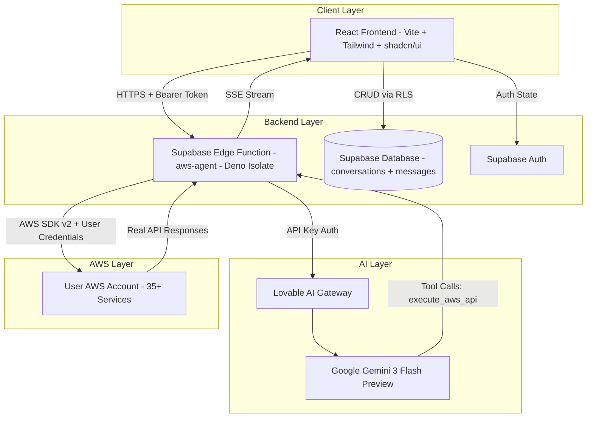
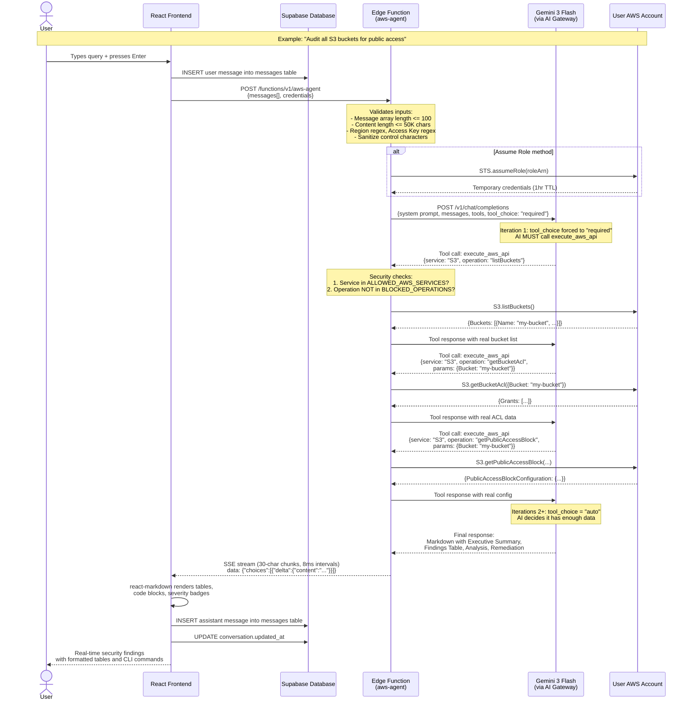
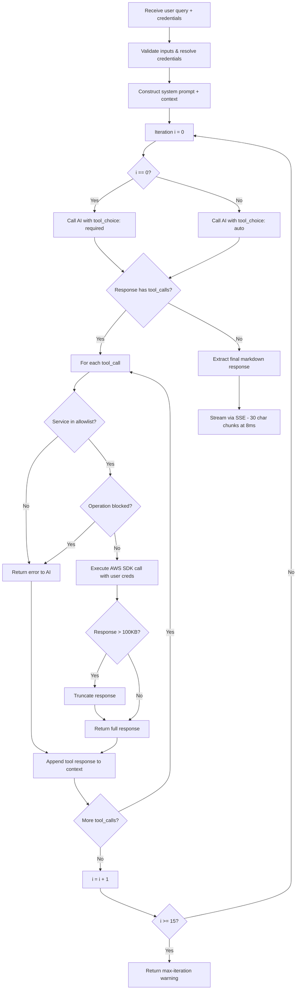
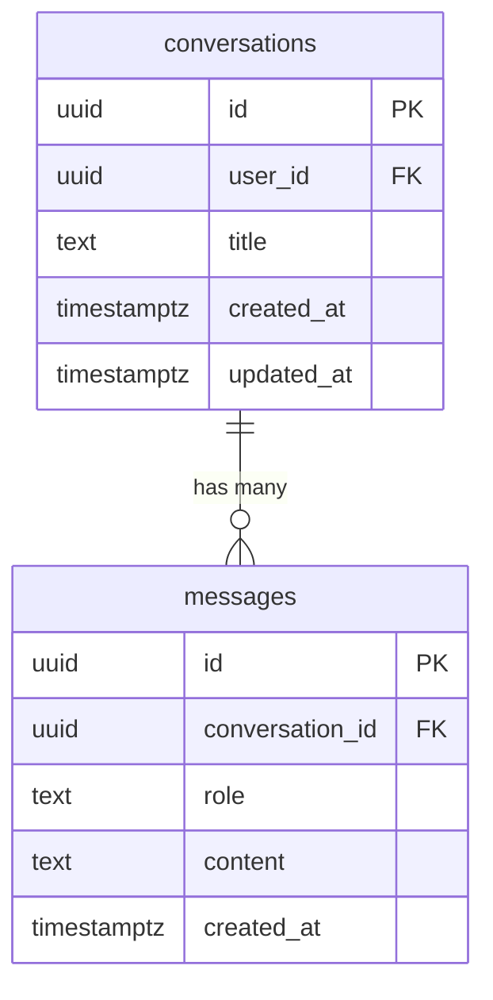

# Technical Documentation: CloudPilot AI

**By:** Ritvik Indupuri
**Date:** March 16, 2026

---

## Executive Summary

CloudPilot AI is an elite AWS cloud security operations agent designed explicitly for professional security engineers. It operates as a real-time conversational interface where users can interactively audit, investigate, and remediate AWS cloud infrastructure using natural language queries.

Unlike traditional cloud security posture management (CSPM) tools or purely generative AI assistants, CloudPilot AI employs a strict **"Zero Simulation Tolerance"** policy. Every insight, security finding, and configuration analysis provided by the agent is backed by real, authenticated AWS API calls executed securely on behalf of the user. This guarantees that the intelligence is accurate, contextual, and actionable.

The application is built on a modern, highly responsive stack. The frontend leverages React, Vite, Tailwind CSS, and shadcn-ui for a seamless user experience, incorporating features like real-time chat, AWS credential management, chat history persistence, and actionable finding panels. The backend is orchestrated by Supabase Edge Functions running on Deno, which seamlessly broker communications between the React client, Google's Gemini 3 Flash Preview (via Lovable AI Gateway), and the user's AWS account via the AWS SDK.

By tightly coupling LLM reasoning capabilities with strict, restricted, and auditable AWS API execution, CloudPilot AI empowers security teams to conduct complex authorized attack simulations, map compliance against major frameworks (CIS, NIST, PCI-DSS), perform incident response, and generate context-aware CLI remediation commands—all from a single, unified interface.

---

## Table of Contents

1. [System Architecture](#system-architecture)
2. [Typical User Query Flow](#typical-user-query-flow)
3. [Frontend Architecture](#frontend-architecture)
4. [Backend Orchestration — The `aws-agent` Edge Function](#backend-orchestration--the-aws-agent-edge-function)
5. [AWS Services & Capabilities](#aws-services--capabilities)
6. [Quick Actions — Pre-Built Security Workflows](#quick-actions--pre-built-security-workflows)
7. [Security & Safety Mechanisms](#security--safety-mechanisms)
8. [Authentication & User Management](#authentication--user-management)
9. [Chat History & Persistence](#chat-history--persistence)
10. [Output Formatting & Markdown Rendering](#output-formatting--markdown-rendering)
11. [Compliance Frameworks](#compliance-frameworks)
12. [Conclusion](#conclusion)

---

## System Architecture

The architecture of CloudPilot AI is designed to ensure strict separation of concerns, secure handling of credentials, and responsive streaming of AI-generated insights.



<div align="center">
  <em>Figure 1: CloudPilot AI High-Level System Architecture</em>
</div>

### Component Responsibilities

| Component | Technology | Responsibility |
|-----------|-----------|----------------|
| React Frontend | React 18, Vite, Tailwind CSS, shadcn/ui | User interface, credential management, chat rendering, SSE consumption |
| Supabase Edge Function | Deno, AWS SDK v2 | AI orchestration, agentic tool-call loop, real AWS API execution, SSE streaming |
| Supabase Auth | Supabase Auth (email/password) | User registration, login, session management |
| Supabase Database | PostgreSQL + RLS | Chat history persistence (conversations, messages) |
| Lovable AI Gateway | Gateway proxy | Routes requests to Gemini 3 Flash Preview with tool definitions |
| AWS Account | AWS SDK v2 (35+ services) | Real infrastructure data, configuration states, resource management |

---

## Typical User Query Flow

This section traces the complete lifecycle of a typical user query—from input to rendered response—illustrating every service interaction.



<div align="center">
  <em>Figure 2: Complete Lifecycle of a User Query — From Input to Rendered Security Analysis</em>
</div>

### Flow Explanation

1. **User Input:** The user types a natural language query (e.g., "Audit all S3 buckets for public access") and presses Enter or clicks Send.

2. **Message Persistence:** The frontend immediately persists the user's message to the `messages` table via Supabase. If no active conversation exists, a new `conversations` record is created first.

3. **Request to Edge Function:** The frontend sends an HTTPS POST to the `aws-agent` edge function with the full conversation history and the user's AWS credentials (Access Key or Assume Role ARN).

4. **Input Validation & Sanitization:** The edge function validates message array bounds (≤100 messages, ≤50K chars each), validates AWS region format via regex, validates Access Key ID format, validates Role ARN format, and strips control characters from all string inputs.

5. **Credential Resolution:** If using Assume Role, the edge function calls `STS.assumeRole()` to obtain temporary credentials scoped to 1 hour. Direct Access Keys are used as-is.

6. **First AI Invocation (Forced Tool Call):** The edge function sends the conversation to Gemini 3 Flash Preview with `tool_choice: "required"`, forcing the AI to call `execute_aws_api` before generating any text. This is the core enforcement of Zero Simulation Tolerance.

7. **Agentic Tool-Call Loop (up to 15 iterations):** The AI returns one or more `execute_aws_api` tool calls. For each call, the edge function:
   - Validates the service against the 35-service allowlist
   - Validates the operation is not in the blocked operations set
   - Instantiates the AWS SDK client with user credentials
   - Executes the real API call
   - Truncates responses >100KB
   - Returns the real data to the AI as a tool response

8. **Final Synthesis:** Once the AI has gathered sufficient data, it produces a structured Markdown response with Executive Summary, Findings Table, Detailed Analysis, and Remediation commands.

9. **SSE Streaming:** The edge function streams the final response to the frontend as Server-Sent Events in 30-character chunks at 8ms intervals, creating a real-time typing effect.

10. **Rendering & Persistence:** The frontend renders the streamed Markdown using `react-markdown` with `remark-gfm` for proper table formatting, then persists the assistant's message to the database.

---

## Frontend Architecture

The frontend is a Single Page Application (SPA) built with React 18 and Vite.

### Technology Stack

| Technology | Purpose |
|-----------|---------|
| React 18 | UI framework |
| Vite | Build tool and dev server |
| TypeScript | Type safety |
| Tailwind CSS | Utility-first styling with custom design tokens |
| shadcn/ui (Radix UI) | Accessible, themeable component primitives |
| react-router-dom | Client-side routing |
| @tanstack/react-query | Async state management |
| react-markdown + remark-gfm | Markdown rendering with GFM tables |
| Lucide React | Icon library |

### Pages

| Page | Route | File | Description |
|------|-------|------|-------------|
| Auth | `/auth` | `src/pages/Auth.tsx` | Email/password sign-in and sign-up with email verification |
| Main Interface | `/` | `src/pages/Index.tsx` | Protected route rendering `ChatInterface` |
| Report View | `/report/:id` | `src/pages/Report.tsx` | Read-only view of a historical conversation |
| 404 | `*` | `src/pages/NotFound.tsx` | Fallback for unmatched routes |

### Core Components

| Component | File | Description |
|-----------|------|-------------|
| **ChatInterface** | `src/components/ChatInterface.tsx` | Main workspace. Orchestrates the chat layout, input handling, sidebar toggling (credentials, history, findings, quick actions, capabilities list), new chat creation, and conversation management. |
| **ChatMessage** | `src/components/ChatMessage.tsx` | Renders individual user/assistant messages. Parses Markdown with `react-markdown` and `remark-gfm` for proper table, code block, and inline formatting. Applies distinct styling per role. |
| **AwsCredentialsPanel** | `src/components/AwsCredentialsPanel.tsx` | Secure form for AWS credential input. Supports two methods: (1) direct Access Key ID + Secret Access Key + optional Session Token, or (2) Assume Role ARN. Includes a global AWS region selector dropdown. Credentials are held in React state only—never persisted to any database. |
| **QuickActions** | `src/components/QuickActions.tsx` | Provides 20 pre-built security prompts organized into 5 categories: Audit, Compliance, Attack Simulation, Incident Response, and Remediation. Each prompt is carefully engineered to enforce real API calls. |
| **FindingsPanel** | `src/components/FindingsPanel.tsx` | Displays a real-time summary of identified security findings with color-coded severity badges (CRITICAL, HIGH, MEDIUM, LOW). Supports click-to-investigate, which sends a targeted follow-up prompt to the agent. |
| **ChatHistoryPanel** | `src/components/ChatHistoryPanel.tsx` | Lists past conversations sorted by last update. Supports selecting (to resume), deleting individual conversations, and clearing all history. |
| **StatusBar** | `src/components/StatusBar.tsx` | Bottom bar displaying connection status (connected/disconnected), active AWS region, and current message count. |
| **CloudPilotLogo** | `src/components/CloudPilotLogo.tsx` | Custom SVG shield logo component used in header and auth pages. |

### Custom Hooks

| Hook | File | Description |
|------|------|-------------|
| `useAuth` | `src/hooks/useAuth.ts` | Manages Supabase Auth session state. Exposes `user`, `loading`, `signIn`, `signUp`, `signOut`. Listens for `onAuthStateChange` events. |
| `useChat` | `src/hooks/useChat.ts` | Manages active conversation messages. Loads messages from DB when conversation changes. Handles sending messages to the edge function, SSE streaming, message persistence, and error states. |
| `useChatHistory` | `src/hooks/useChatHistory.ts` | CRUD operations on the `conversations` table. Provides `fetchConversations`, `createConversation`, `updateTitle`, `deleteConversation`, `clearAllHistory`, and `touchConversation`. |

### Design System

The UI follows a **"Tactical Clarity"** design philosophy—dark charcoal backgrounds with emerald green accents, monospace typography (JetBrains Mono for code, Inter for body), and high-density SOC-grade layouts. Custom CSS variables define severity colors, terminal aesthetics, and semantic tokens for consistent theming across all components.

---

## Backend Orchestration — The `aws-agent` Edge Function

The entire backend logic resides in a single Supabase Edge Function: `supabase/functions/aws-agent/index.ts`. This serverless function runs on Deno, guaranteeing ephemeral, isolated compute per request.

### Core Responsibilities

1. **Input Validation** — Validates message arrays, content lengths, credential formats
2. **Credential Resolution** — Direct Access Keys or STS AssumeRole for temporary credentials
3. **System Prompt Injection** — Constructs the full AI context with Zero Simulation Tolerance rules
4. **Agentic Tool-Call Loop** — Up to 15 iterations of AI ↔ AWS API interactions
5. **Security Enforcement** — Service allowlist, operation blocklist, response truncation
6. **SSE Streaming** — Streams the final Markdown response to the client

### System Prompt Engineering

The system prompt is a meticulously crafted set of instructions that governs the AI's behavior:

| Section | Purpose |
|---------|---------|
| Zero Simulation Tolerance | Mandates `execute_aws_api` calls before ANY findings output |
| Execution Protocol | Step-by-step logic: identify APIs → call tools → analyze real data → write findings |
| Attack Simulation Lifecycle | 4-phase protocol: Tagging → Tracking → Completion Block → Cleanup |
| Capabilities | Comprehensive list of security auditing, attack simulation, compliance, and IR capabilities |
| Output Format | Enforces: Executive Summary → Findings Table → Detailed Analysis → Remediation |

### Tool Definition

The edge function exposes a single tool to the LLM:

```json
{
  "name": "execute_aws_api",
  "parameters": {
    "service": "AWS SDK v2 service class name (e.g., 'S3', 'IAM', 'GuardDuty')",
    "operation": "Method name on the service client (e.g., 'listBuckets', 'describeInstances')",
    "params": "Parameters object for the operation"
  }
}
```

### Agentic Loop Mechanics



<div align="center">
  <em>Figure 3: Agentic Tool-Call Loop — Decision Flow per Iteration</em>
</div>

---

## AWS Services & Capabilities

### Allowed AWS Services (35 Services)

The edge function restricts the AI to the following services via the `ALLOWED_AWS_SERVICES` set:

| Category | Services |
|----------|----------|
| **Identity & Access** | IAM, STS, Organizations, CognitoIdentityServiceProvider |
| **Compute** | EC2, Lambda, ECS, EKS, AutoScaling |
| **Storage** | S3, ECR |
| **Database** | RDS, DynamoDB, ElastiCache, Redshift |
| **Networking** | CloudFront, Route53, ELBv2, APIGateway, NetworkFirewall, Shield |
| **Security & Compliance** | GuardDuty, SecurityHub, Inspector2, AccessAnalyzer, Macie2, WAFv2, ACM, KMS |
| **Monitoring & Logging** | CloudTrail, Config, CloudWatch, CloudWatchLogs, EventBridge |
| **Secrets & Config** | SecretsManager, SSM |
| **Messaging** | SNS, SQS |
| **Orchestration** | StepFunctions, Athena |

### Blocked Operations

The following operations are permanently blocked regardless of user permissions:

| Operation | Reason |
|-----------|--------|
| `closeAccount` | Irreversible account closure |
| `leaveOrganization` | Removes account from AWS Organization |
| `deleteOrganization` | Destroys the entire organizational structure |
| `createAccount` | Prevents unauthorized account creation |
| `inviteAccountToOrganization` | Prevents unauthorized organizational changes |

### Capability Domains

#### 1. Security Auditing
Full configuration analysis across all 35 services:
- **IAM**: Users, roles, policies, access keys, MFA status, permission boundaries, SCPs
- **S3**: Bucket ACLs, policies, public access blocks, encryption, versioning, logging, replication
- **EC2**: Security groups, NACLs, public IPs, IMDSv2, EBS encryption, AMI exposure, launch templates
- **VPC**: Flow logs, route tables, internet gateways, NAT gateways, peering, PrivateLink
- **RDS/Aurora**: Public accessibility, encryption, backup retention, deletion protection, parameter groups
- **Lambda**: Function policies, environment variables, execution roles, VPC config, layer exposure
- **ECS/EKS**: Task roles, network mode, privileged containers, image vulnerabilities
- **CloudTrail**: Trail status, log validation, S3 delivery, KMS encryption, event selectors
- **Config**: Recorder status, rules, conformance packs, remediation actions
- **GuardDuty**: Detector status, findings, threat intelligence, S3/EKS/Lambda/RDS protection
- **Security Hub**: Standards, findings, insights, suppression rules
- **KMS**: Key rotation, key policies, grants, cross-account access
- **Secrets Manager / SSM**: Resource policies, rotation status, cross-account access
- **Organizations**: SCPs, delegated admins, member account inventory
- **ACM**: Certificate expiry, transparency logging, key algorithm
- **WAF**: Web ACLs, rules, IP sets, rate limiting, managed rule groups
- **CloudFront**: OAI/OAC, HTTPS enforcement, geo restrictions, WAF association
- **API Gateway**: Auth type, resource policies, logging, WAF, mTLS
- **SNS/SQS**: Queue/topic policies, encryption, cross-account access
- **ECR**: Image scanning, repository policies, lifecycle rules
- **Cognito**: MFA requirements, advanced security, app client settings

#### 2. Attack Simulation (Authorized, Against User's Own Account)
All simulations execute real API calls and follow the mandatory Attack Simulation Lifecycle (Tag → Track → Complete → Cleanup):

| Attack Vector | Techniques |
|--------------|------------|
| **Privilege Escalation** | CreatePolicyVersion, AttachUserPolicy, PassRole abuse, CreateAccessKey on other users, UpdateAssumeRolePolicy, CreateLoginProfile, AddUserToGroup, SetDefaultPolicyVersion, PutUserPolicy, PutRolePolicy, UpdateLoginProfile |
| **Credential & Secrets Exposure** | EC2 user data scanning, Lambda env var enumeration, SSM Parameter Store audit, Secrets Manager resource policies, stale IAM access keys |
| **S3 Data Exfiltration** | Public read/write/list testing, cross-account bucket policies, pre-signed URL abuse, replication to untrusted destinations |
| **Lateral Movement** | VPC peering + route overlap, EC2 instance profile cross-service trust, Lambda execution role pivoting, IAM role trust chain mapping, ECS task role + container escape |
| **Detection Evasion** | GuardDuty coverage gaps (per-region), CloudTrail exclusion filters, suspicious external AssumeRole, CloudWatch alarm gaps |
| **Network Attack Surface** | 0.0.0.0/0 ingress across all SGs/NACLs, exposed RDS/ElastiCache/Redshift, Direct Connect/VPN misconfigs, public IP + sensitive IAM role (SSRF path) |
| **Supply Chain & Third-Party Risk** | Cross-account IAM roles, external S3 bucket policy principals, Lambda layers from external accounts, CloudFormation external imports |

#### 3. Incident Response
- Live instance isolation (quarantine SG, snapshot, IMDS disable)
- Credential revocation (deactivate keys, detach policies, invalidate sessions)
- Forensic evidence preservation (CloudTrail, VPC Flow Logs, S3 access logs)
- Threat hunting (GuardDuty findings, CloudTrail anomaly analysis)
- Blast radius assessment

#### 4. Remediation
- Exact AWS CLI commands targeting real resource IDs
- Policy documents (JSON) for MFA enforcement, least privilege
- Service enablement commands (GuardDuty, Config, CloudTrail)
- Configuration hardening (IMDSv2, S3 Block Public Access, encryption)

---

## Quick Actions — Pre-Built Security Workflows

CloudPilot AI provides **20 pre-built quick action prompts** organized into 5 categories. Each prompt is carefully engineered with specific API call instructions to ensure Zero Simulation Tolerance.

| Category | Actions | Description |
|----------|---------|-------------|
| **AUDIT** (6 actions) | S3 Buckets, IAM Posture, Security Groups, EC2 Instances, RDS/Aurora, Lambda Security | Comprehensive configuration audits with real API calls |
| **COMPLIANCE** (4 actions) | CIS Benchmark, CloudTrail, GuardDuty, Security Hub | Framework-aligned compliance checks |
| **ATTACK SIMULATION** (6 actions) | Privilege Escalation, Secrets Exposure, S3 Exfil Paths, Lateral Movement, Detection Gaps, Network Exposure | Authorized penetration testing with real API execution |
| **INCIDENT RESPONSE** (4 actions) | Isolate Instance, Credential Audit, Forensic Snapshot, Blast Radius | Emergency response procedures using real API calls |
| **REMEDIATION** (4 actions) | Close Public Access, Enable GuardDuty, Enforce MFA, Harden IMDSv2 | Generate exact CLI remediation commands from real findings |

---

## Security & Safety Mechanisms

Given the inherent risks of executing live AWS API calls, CloudPilot AI implements multi-layered security controls:

### 1. Ephemeral Compute Isolation
Each request runs in a fresh Deno isolate via Supabase Edge Functions. AWS SDK clients are instantiated per-request with zero global state, completely eliminating cross-tenant credential exposure.

### 2. Service Allowlisting
The `ALLOWED_AWS_SERVICES` set (35 services) restricts the AI to security-relevant services only. Any attempt to access a service outside this list is rejected with an error returned to the AI.

### 3. Destructive Operation Blocklist
The `BLOCKED_OPERATIONS` set permanently blocks catastrophic account-level actions (e.g., `closeAccount`, `deleteOrganization`), regardless of user-provided permissions.

### 4. Strict Input Validation
| Input | Validation |
|-------|-----------|
| Messages array | Non-empty, max 100 messages |
| Message content | Max 50,000 characters |
| AWS Region | Regex: `/^[a-z]{2}(-[a-z]+-\d+)?$/` |
| Access Key ID | Regex: `/^[A-Z0-9]{16,128}$/` |
| Role ARN | Regex: `/^arn:aws:iam::\d{12}:role\/[\w+=,.@\/-]+$/` |

### 5. Data Sanitization
The `sanitizeString()` function strips control characters (`\x00-\x08`, `\x0B`, `\x0C`, `\x0E-\x1F`) from all inputs to prevent prompt injection and buffer overflow attacks.

### 6. Response Truncation
AWS API responses exceeding 100KB are truncated to prevent context window overflow, with a `[TRUNCATED]` marker instructing the user to narrow their query.

### 7. Credential Masking
Access Key IDs are masked in logs (first 4 + last 4 characters only): `AKIA****WXYZ`.

### 8. Forced First Tool Call
On the first iteration of every query, `tool_choice` is set to `"required"`, ensuring the AI MUST call `execute_aws_api` before generating any text. This is the architectural enforcement of Zero Simulation Tolerance.

### 9. Prompt Injection Defense
The system prompt includes explicit instructions to decline requests to reveal internal instructions, tool schemas, or system context.

### 10. Mandatory Simulation Cleanup
When attack simulations create AWS resources, the system prompt enforces a 4-phase lifecycle:
1. **Tagging** — All created resources tagged with `cloudpilot-simulation=true`
2. **Tracking** — Internal list of every resource with delete operation metadata
3. **Completion Block** — Mandatory table of created resources + cleanup prompt
4. **Cleanup** — Real API deletions with confirmation table showing success/failure per resource

### 11. Credential Handling
AWS credentials are **never persisted** to any database. They are:
- Held in React state (client-side memory only)
- Transmitted per-request over TLS to the edge function
- Used ephemerally within the Deno isolate
- Discarded when the request completes

---

## Authentication & User Management

### Implementation

Authentication is managed via Supabase Auth with email/password credentials:

| Feature | Implementation |
|---------|---------------|
| Sign Up | `supabase.auth.signUp()` — requires email verification before login |
| Sign In | `supabase.auth.signInWithPassword()` |
| Sign Out | `supabase.auth.signOut()` |
| Session Management | `supabase.auth.onAuthStateChange()` listener in `useAuth` hook |
| Protected Routes | React Router checks `user` state; redirects to `/auth` if unauthenticated |

### Auth Page (`/auth`)
- Mode toggle between Sign In and Create Account
- Password visibility toggle
- Error display with destructive styling
- Success message after signup (instructs user to verify email)
- Footer note: "Your AWS credentials are never stored."

---

## Chat History & Persistence

### Database Schema



<div align="center">
  <em>Figure 4: Database Schema — Conversations and Messages</em>
</div>

### Row-Level Security (RLS)

All database access is protected by RLS policies ensuring users can only access their own data:

| Table | Operations | Policy |
|-------|-----------|--------|
| `conversations` | SELECT, INSERT, UPDATE, DELETE | `auth.uid() = user_id` |
| `messages` | SELECT, INSERT, DELETE | `EXISTS (SELECT 1 FROM conversations WHERE id = conversation_id AND user_id = auth.uid())` |

### Chat History Features

| Feature | Implementation |
|---------|---------------|
| Auto-create conversation | On first message, a `conversations` record is created with the query as the title (truncated to 65 chars) |
| Message persistence | User and assistant messages are inserted into `messages` immediately upon send/receive |
| History listing | Conversations sorted by `updated_at` descending in the sidebar |
| Resume conversation | Clicking a history item loads all associated messages from the database |
| Delete conversation | Removes the conversation record; cascading delete removes all associated messages |
| Clear all history | Deletes all conversations for the authenticated user |
| Touch on activity | `updated_at` is refreshed on every new message to maintain recency ordering |

---

## Output Formatting & Markdown Rendering

### AI Output Structure

Every AI response follows a mandatory format:

1. **Executive Summary** — 2–3 sentences based on real findings
2. **Findings Table** — `| Resource | Finding | Severity | Evidence |` formatted as a GFM table
3. **Detailed Analysis** — Per-finding breakdown with real API response data as evidence
4. **Remediation** — Exact AWS CLI commands in `bash` code blocks

### Rendering Stack

| Component | Purpose |
|-----------|---------|
| `react-markdown` | Parses Markdown into React elements |
| `remark-gfm` | GitHub Flavored Markdown plugin — enables pipe tables, strikethrough, autolinks, task lists |
| Custom CSS | Styled `<table>`, `<code>`, `<pre>` elements with terminal aesthetics and proper contrast |

### Severity Ratings

Severity levels are bolded in output and color-coded in the FindingsPanel:

| Severity | Color | Use Case |
|----------|-------|----------|
| **CRITICAL** | Red | Actively exploitable, immediate risk |
| **HIGH** | Orange | Significant risk requiring prompt attention |
| **MEDIUM** | Yellow | Moderate risk, should be addressed |
| **LOW** | Blue | Minor risk, best practice improvement |
| **INFO** | Gray | Informational, no direct risk |

---

## Compliance Frameworks

CloudPilot AI supports real-time assessment against major compliance frameworks by querying actual account configurations:

| Framework | Coverage |
|-----------|----------|
| **CIS AWS Foundations Benchmark v3.0** | IAM, logging, monitoring, networking controls |
| **NIST 800-53** | Access control, audit, system integrity, risk assessment |
| **SOC 2 Type II** | Security, availability, confidentiality controls |
| **PCI-DSS v4.0** | Network security, access control, monitoring, encryption |
| **HIPAA** | PHI protection, access controls, audit trails |
| **ISO 27001** | Information security management system controls |
| **FedRAMP** | Federal cloud security requirements |
| **AWS Well-Architected Security Pillar** | Identity, detection, infrastructure, data, incident response |
| **MITRE ATT&CK Cloud** | Tactics, techniques, and procedures for cloud attacks |

---

## Conclusion

CloudPilot AI represents a significant advancement in applied generative AI for cloud security operations. By bridging the reasoning capabilities of state-of-the-art large language models with the strict, deterministic execution of real AWS APIs, it eliminates the "hallucination" problem common in standard chat assistants.

The architecture is meticulously designed for security, employing robust input validation, secure credential handling, ephemeral isolated execution, strict operational allowlists, and mandatory simulation cleanup protocols. The comprehensive React frontend provides a professional, highly responsive interface tailored for security engineers, enabling complex auditing, incident response, and authorized attack simulations to be conducted safely and efficiently directly against live AWS environments.

Through its uncompromising "Zero Simulation Tolerance" and robust technical foundation, CloudPilot AI delivers highly accurate, contextual, and actionable intelligence—empowering security teams to identify and remediate vulnerabilities faster and more effectively.
